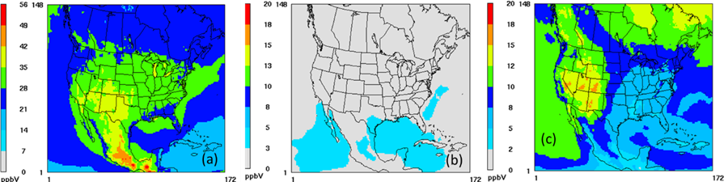

### Photolysis of aerosol nitrate in CB6R5

**Primary Contact**: 
Golam Sarwar, Sarwar.golam@epa.gov, U.S. Environmental Protection Agency
 
 

**Type of update**: Science Update 

**Release Version/Date**:  CMAQv6.0

**Description**:  
This pull request adds photolysis of aerosol nitrate (ANO3) to CB6R5 following the procedure described in Sarwar et al., 2024. It adds a new aerosol species, ASEAST, which represents fine-mode sea-salt. The molecular weight of ASEAST is calculated using sea-salt composition data and the molecular weights of sulfate, chloride, sodium, calcium, magnesium, potassium, and bromide (MWASEAST = 31.3 g/mol). ASEAST and ANO3, and their molecular weights are used to calculate an enhancement factor (EF):

$$ EF = 100 \times \max\left(\frac{[ASEAST]}{[ASEAST] + [ANO3]}, 0.1\right) $$

Where [ASEAST] and [ANO3] are the molar concentration of each species. The EF is then multiplied by the photolysis frequency of nitric acid (HNO3) to calculate the photolysis frequency of ANO3.

**Significance and Impact**:  

Previous versions of CMAQ do not include any photolysis of ANO3. However, recent studies suggest that ANO3 can undergo photolysis to produce HONO and NO2 which can affect CMAQ predicted ozone. Inclusion of this new pathway increased monthly mean ground-level ozone by 13-32% over the modeling domain (Sarwar et al., 2025). Model runs used to test the impact of these code changes are described in Table 1.

**Table 1**. Model simulations over the Contiguous U.S. (CONUS) Domain for the month of May 2022
| Model Run        | Description                                                                                         |
| :---             | :---                                                                                                |
| Base             | Base CMAQ without ANO3 photolysis                                                                   |
| Phot_ANO3_Dom         | CMAQ run with ANO3 photolysis only in the CONUS Domain                                              |
| Phot_ANO3_Dom_ICBC    | CMAQ run with ANO3 photolysis in both the CONUS Domain and in the initial and boundary conditions (ICBC)  |

The impact of ANO3 photolysis on modeled ozone (O3) concentrations is shown in Figure 1. Higher O3 concentrations are predicted over the southern portion of the CONUS domain than the northern portion in the Base run (Fig. 1a). Photolysis of ANO3 slightly enhances O3 when ANO3 photolysis is only active within the modeling domain (Fig. 1b). These minimal impacts can be attributed to a relatively small oceanic area within the CONUS domain (as opposed to that of the entire Northern Hemisphere). In contrast, ANO3 photolysis enhances O3 by larger margins in the Phot_ANO3_Dom_ICBC model run (Fig. 1c), indicating the significance of its effect on O3 concentrations when also included in the boundary conditions.

Figure 1: (a) Modeled episode averaged O3 in the Base run (b) average differences in modeled O3 due to ANO3 photolysis in the CONUS domain (Phot_ANO3_Dom -  Base) and (c) average differences in modeled O3 due to ANO3 photolysis in both the CONUS Domain and in the ICBC (Phot_ANO3_Dom_ICBC - Base).

Daily Mean Bias was calculated by using model predicted daily maximum 8-hour average O3 concentrations (MDA8O3) and observed MDA8O3 from the AQS monitoring network over the Western and Eastern U.S. (Figure 2). Over the Western U.S., model predicted MDA8O3 in the Base run underpredicts observed data for almost all days while model predicted MDA8O3 in the Phot_ANO3_Dom_ICBC run increases MDA8O3 and resolves some of the previous negative bias for majority of the days (Fig. 2a). Wintertime modeled MDA8O3 underpredictions over the Eastern U.S. are also improved in the Phot_ANO3_Dom_ICBC run, with overpredictions of modeled MDA8O3 now occurring during the spring and becoming more pronounced during the summer (Fig. 2b).

Figure 2: Time series of MDA8O3 bias in the Base run and in the Phot_ANO3_Dom_ICBC run at (a) AQS sites over the Western U.S. and (b) Eastern U.S. The Western U.S. consists of the Northwest, Northern Rockies, West, and Southwest climate regions while the Eastern U.S. consists of South, Southeast, Ohio Valley, Upper Midwest, and Northeast climate regions.

The impacts of ANO3 photolysis on modeled PM2.5 concentrations are shown in Figure 3. Photolysis of ANO3 has a minimal effect on PM2.5 concentrations when ANO3 photolysis is only active within the CONUS domain (Fig. 3b). When ANO3 photolysis is also active in the ICBC (Fig. 3c), larger enhancements in PM2.5 concentrations are seen over land. Reductions in PM2.5 occur largely over the oceans and coastal areas - due to the loss of ANO3 via photolysis. Enhancements over land occur due to higher oxidant levels, which increase secondary aerosol formation.

Figure 3: For the month of May 2022 (a) average modeled PM2.5 in the Base run, (b) average differences in modeled PM2.5 due to ANO3 photolysis turned on in the CONUS domain (Phot_ANO3_Dom - Base) and (c) average differences in modeled PM2.5 due to ANO3 photolysis turned on in both the CONUS Domain and in the ICBC (Phot_ANO3_Dom_ICBC - Base). 

Daily Mean Bias was calculated by using model predicted daily mean PM2.5 concentrations and observed PM2.5 concentrations from the AQS monitoring network over the Western and Eastern U.S. (Figure 4). Bias in the Base and Phot_ANO3_Dom_ICBC model runs for each month is similar over the Western and Eastern U.S. Thus, ANO3 photolysis does not greatly impact model performance for PM2.5.

Figure 4: Time series of PM2.5 bias in the Base run and in the Phot_ANO3_Dom_ICBC run at AQS sites over the (a) Western U.S. and (b) over the Eastern U.S.

 **References**:   
Sarwar, G., Henderson, B.H., Hogrefe, C., Mathur, R., Gilliam, R., Callaghan, A., B., Lee, J., Carpenter, L. J.: Examining the Impact of the photolysis of aerosol nitrate over Northern Hemisphere, Science of the Total Environment, 917, 170406, 2024. 

Sarwar, G., Sidi, F., Simon, H., Henderson, B., Willison, J., Gilliam, R., Hogrefe, C., Foley, K., Mathur, R., Appel, W., 2025: Representing particulate nitrate photolysis over seawater improves CMAQ ozone predictions over the contiguous United States, Science of the Total Env., 970, 178968.

|Merge Commit | Internal record|
|:------:|:-------:|
|[Merge for PR#1382](https://github.com/USEPA/CMAQ/commit/4d4f27dca58bcfb4de8e6af3f67ce9f26223758f) | [PR#1382](https://github.com/USEPA/CMAQ_Dev/pull/1382)  | 
|[Merge for PR#1396](https://github.com/USEPA/CMAQ/commit/a51dda79ddb6c13ade9b21243600c8a85b438f66) | [PR#1396](https://github.com/USEPA/CMAQ_Dev/pull/1396)  | 

### Correction to molecular weight of HGIIGAS in species tables

**Kristen Foley**, U.S. Environmental Protection Agency (Please direct questions to [CMAQ_Team@epa.gov](mailto:CMAQ_Team@epa.gov).)   
**Type of update:** Documentation Update   
**Release Version/Date:** CMAQv5.5  
**Description:** The molecular weight for HGIIGAS was incorrectly listed as 200.6 in the species tables for cb6r3_ae7_aq, cb6r5_ae7_aq, cb6r5hap_ae7_aq, cb6r5m_ae7_aq. This documentation can be found under CCTM/src/MECHS/README.md.  The molecular weight used in GC namelist files for these mechanisms is 271.5. The documentation in the species tables has been updated to be consistent with the namelist files (based on Donohoue et al.m 2005).  

This issue was first identified on the CMAS User forum by Shengpo (https://forum.cmascenter.org/t/error-of-the-molecular-weight-for-hgiigas/4673).  

**Significance and Impact**: Documentation updates only. No changes to model results.  

**References**:  
Deanna L. Donohoue, Dieter Bauer, and Anthony J. Hynes. The Journal of Physical Chemistry A 2005 109 (34), 7732-7741. DOI: 10.1021/jp051354l 

|Merge Commit | Internal record|
|:------:|:-------:|
|[Merge for PR#1081](https://github.com/USEPA/CMAQ/commit/30de01b8e0303592b70439908a0b4b02708f881f) | [PR#1081](https://github.com/USEPA/CMAQ_Dev/pull/1081)  | 
 

### Carbon Bond Chemical Mechanism Version 6 Release 5  (CB6r5)

[Golam Sarwar](mailto:sarwar.golam@epa.gov), U.S. Environmental Protection Agency  

**Type of update:** Science Update 

**Release Version/Date:** CMAQv5.4  

**Description:** 

Ramboll, the developer of the Carbon Bond chemical mechanism, recently updated the chemical mechanism (CB6r5) and implemented it into the Comprehensive Air quality Model with extensions (CAMx) (Yarwood et al., 2020). CMAQ currently uses CB6r3 chemical mechanism which is updated into CB6r5. Following changes are included in CB6r5.

• Updated rate constants for 41 reactions

• Updated photolysis rates for 6 reactions: formaldehyde (two channels), acetaldehyde, higher aldehyde, glyco-aldehyde, glyoxal

• Updated reaction products and yields for several reactions

• An additional reaction (Amedro et al., 2020): NO2 + OH + H2O = HNO3 + H2O; H2O is more effective as a third body than N2 or O2 and the reaction is more effective in humid regions.

• No changes in emissions are needed for CB6r5

**Significance and Impact**:

Model simulations were completed with the CB6r3 and CB6r5 over the continental United States for a winter (January) and a summer (July) month in 2016. The update increases monthly mean ozone in both month (Figure 1); however, it also decreases ozone over some areas by small margin. Overall, the impacts of the update on model predictions are small. The impacts are slightly larger in summer than those in winter. It affects Model Bias both at AQS and CASTNET sites (Figure 2) by small margins.

Figure 1: Impact of CB6r5 on monthly mean ozone

Figure 2: Impact of CB6r5 on monthly mean Model Bias at AQS and CASTNET sites

**References**:
1. Yarwood, G.; Shi, Y.; Beardsley, R., 2020. Impact of CB6r5 mechanism changes on air pollutant modeling in Texas. Final Report for the Texas Commission on Environmental Quality, Work Order No. 582-20-11221-014.
2. Amedro, D., Berasategui, M., Bunkan, A. J. C., Pozzer, A., Lelieveld, J., and Crowley, J. N.: Kinetics of the OH + NO2 reaction: effect of water vapour and new parameterization for global modelling, Atmos. Chem. Phys., 20, 3091–3105, https://doi.org/10.5194/acp-20-3091-2020, 2020.

|Merge Commit | Internal record|
|:------:|:-------:|
|[Merge for PR#731](https://github.com/USEPA/CMAQ/commit/deb5b42cdd0041549a4aa5b8e6d069f2b75c203d) | [PR#731](https://github.com/USEPA/CMAQ_Dev/pull/731)  | 

### Simple Halogen Chemistry Update

[Golam Sarwar](sarwar.golam.email@epa.gov), U.S. Environmental Protection Agency  

**Type of update**: Science Update   

**Release Version/Date**: CMAQv5.4

**Description**: Several changes were made to the simple halogen chemistry which are described below:

First change:

A simple halogen mediated first order ozone loss was previously developed by using hemispheric CMAQ results obtained without and with detailed bromine/iodine chemistry. The detailed bromine/iodine chemistry has recently been updated and hemispheric model simulations were completed without and with the updated bromine/iodine chemistry for 2016. The simple halogen mediated first order ozone loss is re-derived using the annual hemispheric CMAQ results obtained without and with full bromine/iodine chemistry. The revised halogen mediated first-order rate constant for ozone loss:

k_O3 (P) = min⁡ ( 2.0×10E-06, 6.7006×10E-11 exp(10.7435×P)+ 3.4153×10E-8 exp(-0.6713×P) )

Where kO3 (s-1) is the first-order rate constant and P is the atmospheric pressure (atm). It is applied to grid-cells over oceanic areas. The revised halogen mediated first-order rate constant for ozone loss is lower than the previous value.

Second change:

Ocean files are generated using spatial allocator. Winston Hao of New York Department of Environmental Conservation reported that ocean file generated by the spatial allocator may occasionally contain some tiny (~1E-09) negative and positive values for SURF and OPEN near state borders. Simple halogen chemistry is activated when OPEN+SURF value in any grid-cell is positive (>0.0). The presence of tiny positive SURF and OPEN values activates the simple halogen chemistry over land and reduces ozone. CMAQ has a check for negative values of OPEN and SURF which are reset to 0.0 as follows (centeralized_io_module.F):

WHERE ( ocean .LT. 0.0 ) ocean = 0.0  ! ensure values are nonnegative
WHERE ( szone .LT. 0.0 ) szone = 0.0  ! ensure values are nonnegative

To avoid the activation of the simple halogen chemistry when tiny positive values are present, the existing checks are revised so that any negative and small positive values are reset to 0.0 as follows:

WHERE ( ocean .LT. 0.001 ) ocean = 0.0  ! ensure values are greater than 0.001
WHERE ( szone .LT. 0.001 ) szone = 0.0  ! ensure values are greater than 0.001 

Third change:

The condensed halogen chemistry is activated when OPEN+SURF value in any grid-cell > 0.001; otherwise it is inactive. When the condensed halogen chemistry is active, halogen mediated ozone loss occurs with a prescribed first order rate constant. In the existing implementation, the prescribed first order rate constant does not vary with the values of OPEN+SURF. Values of OPEN+SURF is 1.0 over open ocean; however, values can be less than 1.0 near coastal areas. In the updated implementation, the prescribed first order rate constant is multiplied by the value of OPEN+SURF to account for the halogen mediated ozone loss. The full extent of the halogen mediated ozone loss occurs over open ocean since OPEN+SURF = 1.0 over such areas. In contrast, impact of the halogen mediated ozone loss is reduced over coastal areas since OPEN+SURF < 1.0 over such areas. SEAICE can be present in some grid-cells. The presence of SEAICE was previously used to simply turn-on or turn-off the condensed halogen chemistry. It is now included in the calculation of the halogen mediated rate constant.

Existing implementation of the condensed halogen chemistry:

k = prescribed first order halogen mediated rate constant when OPEN+SURF > 0.001 and no SEAICE is present.
k = 0 when OPEN+SURF ≤ 0.001 or SEAICE is present

Updated implementation of the condensed halogen chemistry:

k = (OPEN + SURF - SEAICE) × prescribed first order halogen mediated rate constant when OPEN+SURF > 0.001
k = 0 when OPEN+SURF ≤ 0.001

**Significance and Impact**:  

First change:

Model sensitivity runs were completed using cb6r3_ae7_aq chemical mechanism with the existing and updated simple first order ozone loss for the continental US domain for a period of 9-days in summer (June 22-30, 2016). The revised simple first order ozone loss increases the average ozone over seawater and coastal areas by up to 1.5 ppbv. Impact is higher over seawater than over coastal area. Impact over the interior portion of the domain is negligible. 

  
**Figure 1: Impact of the updated simple halogen chemistry on O3**

Second change:

Model sensitivity runs were completed using the existing and updated checks for OPEN and SURF values for a 10-day period in summer. Model with updated checks for OPEN and SURF values has only small impacts on predicted results. The mean difference in O3 concentrations during the 10-day period are shown in Figure 2. Note that the ocean file used in this test does not contain any tiny positive values along state borders; hence the problem reported by a CMAQ user does not show up in the model results.

**Figure 2: Impact of using a threshold value of 0.001 for OPEN and SURF values on O3**

Third change:

Two different model simulations were completed using the existing and updated implementation of the condensed halogen chemistry for 10 days in summer (June 21 -  June 30, 2016). It employed 12-km horizontal grid resolution with 35 vertical layers. The difference in O3 concentrations (updated – existing implementation) is shown in Figure 3. Model with the updated implementation does not have any impact on O3 over open ocean. However, it increases O3 over coastal areas when OPEN+SURF  < 1.0. 

**Figure 3: Impact of the updated implementation of halogen chemistry on O3**

**References**:  

1.	Sarwar, G.; Gantt, B.; Foley, K.; Fahey, K.; Spero T. L.; Kang, D., Mathur, Rohit M., Hosein F.; Xing, J.; Sherwen, T.; Saiz-Lopez, A., 2019: Influence of bromine and iodine chemistry on annual, seasonal, diurnal, and background ozone: CMAQ simulations over the Northern Hemisphere, Atmospheric Environment, 213, 395-404.
2.	Sarwar, G.; Gantt, B.; Schwede, D.; Foley, K.; Mathur, M.; Saiz-Lopez, A., 2015: Impact of enhanced ozone deposition and halogen chemistry on tropospheric ozone over the Northern Hemisphere, Environmental Science & Technology, 49(15):9203-9211.

|Merge Commit | Internal record|
|:------:|:-------:|
|[Merge for PR#712](https://github.com/USEPA/CMAQ/commit/33a020e2ad4ce8fbf0ce2982e2ab139017afd71f) | [PR#712](https://github.com/USEPA/CMAQ_Dev/pull/712)  |
|[Merge for PR#784](https://github.com/USEPA/CMAQ/commit/c197c5d98b0f3218092a2c2b2050b3b27c95f138) | [PR#784](https://github.com/USEPA/CMAQ_Dev/pull/784)  | 
|[Merge for PR#870](https://github.com/USEPA/CMAQ/commit/b26adbc5c00f1ebd5f2361c13cf82c437bac9ccd) | [PR#870](https://github.com/USEPA/CMAQ_Dev/pull/870)  |  

### DMS Chemistry

[Golam Sarwar](sarwar.golam.email@epa.gov), U.S. Environmental Protection Agency 

**Type of update**: New Feature  

**Release Version/Date**: CMAQv5.4

**Description**:  

Dimethyl sulfide (DMS) chemistry was previously added in the hemispheric CMAQ model. The details of the chemistry, emissions and their impact on model results over the Northern Hemisphere are described in Zhao et al. (2021). Here, DMS chemistry is combined with cb6r5 chemical mechanism and implemented into the regional CMAQ model. The DMS chemistry consists of 2 chemical reactions with OH, 1 reaction with NO3, and 1 reaction with Cl. 

DMS + OH = SO2 + MEO2 + FORM (abstraction channel)

DMS + OH = 0.75 × SO2 + 0.25 × MSA + MEO2 (addition channel)

DMS + NO3 = SO2 + HNO3 + MEO2 + FORM

DMS + Cl = 0.86 × SO2 + 0.14 × MSA + MEO2 + 0.45 × FORM + 0.45 × HCl + 0.55 ×ClO

These reactions produce SO2 which is then oxidized into sulfate via gas-phase and aqueous-phase chemical reactions. DMS emissions from ocean are calculated using the gas transfer velocity and climatological DMS concentrations in seawater reported by Lana et al. (2011).

**Significance and Impact**:  

Model sensitivity simulations were completed using cb6r5_ae7_aq chemical mechanism without and with the DMS chemistry over the continental US domain for January and July in 2016. DMS chemistry enhances SO2 over seawater and adjacent land areas by 0-45 pptV in January and 0-60 pptV in July (Figure 1). It  enhances sulfate over seawater and adjacent land areas by 0-0.2 μg/m3 in January and 0-0.7 μg/m3 in July (Figure 2). Impact over the interior portion of the modeling domain is generally small.

Impact of the DMS chemistry on model performance was calculated using data from all networks (Figure 3). It can affect Normalized Mean Bias for sulfate at CASTNET, CSN and IMPROVE networks. However, the impacts are generally small when all sites are considered for calculating Normalized Mean Bias. Impacts on Normalized Mean Bias can be higher in coastal areas. It’s impact on ozone is small (< ±0.3 ppb) and impact on model performance is negligible.

**Figure 1: (a) mean SO2 without DMS chemistry in January (b) impact of DMS chemistry on SO2 in January (c) mean SO2 without DMS chemistry in July (d) impact of DMS chemistry on SO2 in July**

**Figure 2: (a) mean sulfate without DMS chemistry in January (b) impact of DMS chemistry on sulfate in January (c) mean sulfate without DMS chemistry in July (d) impact of DMS chemistry on sulfate in July**

**Figure 3: Normalized Mean Bias of sulfate without and with DMS chemistry (a) IMPROVE sites in January (b) CSN sites in January (c) CASTNET sites in January (d) IMPROVE sites in July (e) CSN sites in July (f) CASTNET sites in July**  

Existing ocean files will not work with the DMS chemistry; new ocean files with DMS concentrations in seawater are needed and can be generated using a new python based tool.

**References**:  

1. Zhao, J., Sarwar, G., Gantt, B., Foley, K., Kang, D., Fahey, K., Mathur, R., Henderson, B. H., Pye, H. O. T., Zhang, Y., Saiz-Lopez, A., 2021. Impact of dimethylsulfide chemistry on air quality over the Northern Hemisphere, Atmospheric Environment, 244, 117961:1-10.
2. Lana, A., Bell, T.G., Simó, R., Vallina, S.M., Ballabrera-Poy, J., Kettle, A.J., Dachs, J., Bopp, L., Saltzman, E.S., Stefels, J., Johnson, J.E., Liss, P.S., 2011. An updated climatology of surface dimethlysulfide concentrations and emission fluxes in the global ocean. Global Biogeochemical Cycles, 25, GB1004,doi:10.1029/2010GB003850.
