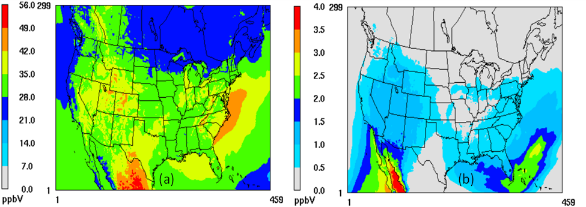
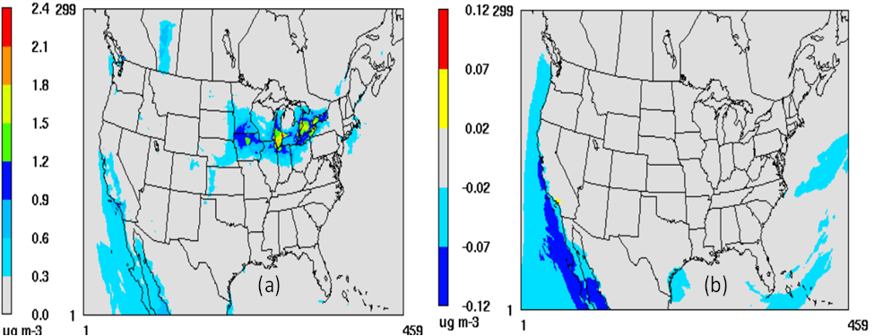
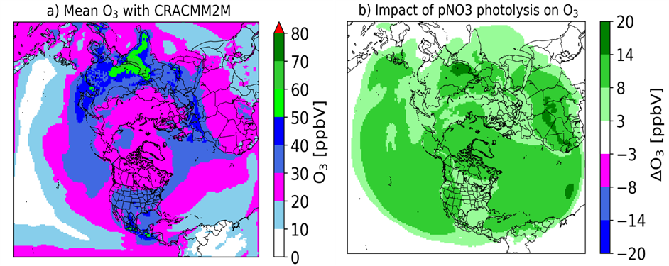
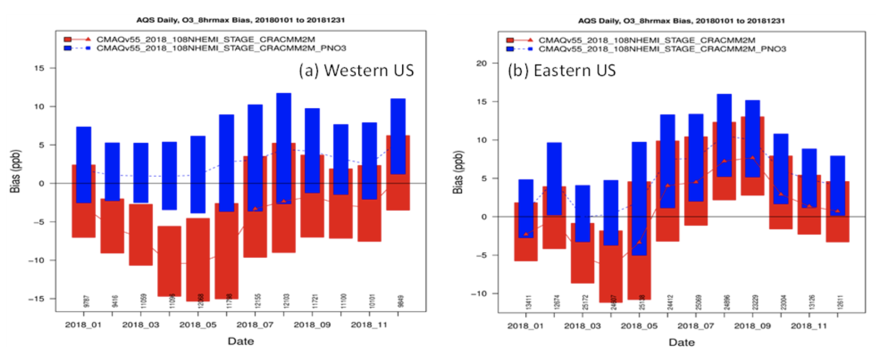
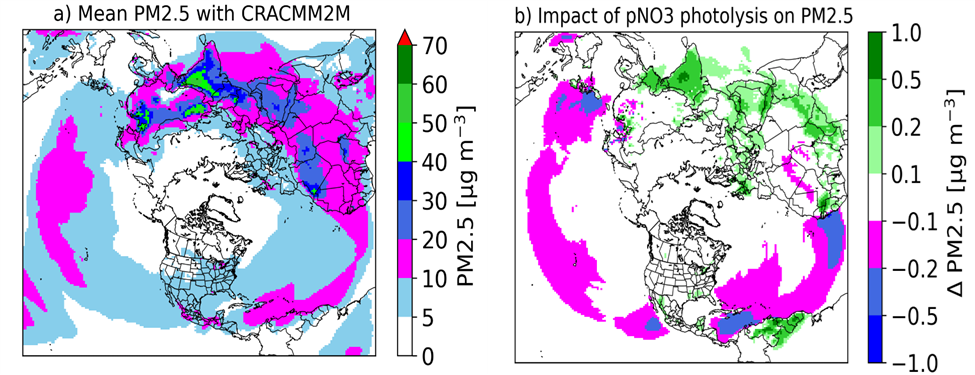
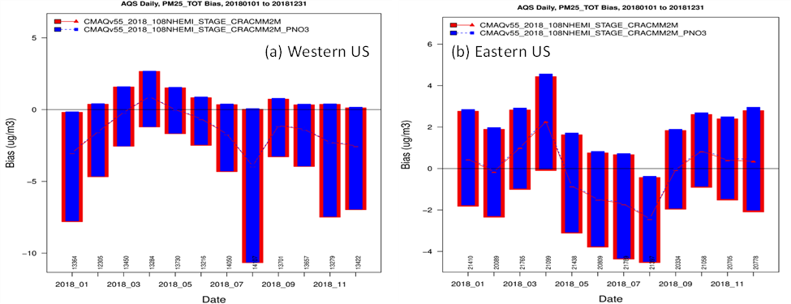

# Community Regional Atmospheric Chemistry Multiphase Mechanism (CRACMM)

### Updated mechanism CRACMM3
[Havala Pye](mailto:pye.havala@epa.gov),  U.S. Environmental Protection Agency    
**Type of update**: Science Update  
**Release Version/Date**: CMAQv6.0  

**Description**:  
CMAQv6.0 includes an updated version of CRACMM called CRACMM3. This version builds on the CMAQv5.5 release of CRACMM2. With the release of CRACMM3, CRACMM1 versions have been deprecated and removed from CMAQv6.0. CRACMM2 remains functional in CMAQv6.0. CRACMM3 is available in 3 versions: a base CRACMM3, CRACMM3HAPs, and CRACMM3M. All three versions share the same core chemistry while two versions have expanded capabilities for specific applications. CRACMM3HAPs includes additional hazardous air pollutants and follows strategies similar to previous versions of CMAQ where several species are added external to the radical budget. Specifically, additional HAPs beyond the base HAPs included in CRACMM3 are included in the "nonreactive" (NR) namelist or included in the aerosol namelist as tracers. The additional HAPs undergo transport, removal, and chemical decay, if applicable. CRACMM3 for marine environments (CRACMM3M) includes additional halogen reactions for environments (not limited to marine) where that chemistry is important. In base CRACMM3, the halogen chemistry is represented by one parameterized reaction as in CRACMM1 but with updated parameters. See the individual release notes for more information.
 
**Significance and Impact**:   
CRACMM3 includes updated chemistry beyond CRACMM2. CRACMM3HAPs and CRACMM3M enable a wider range of applications of CRACMM.

### CRACMM Species Documentation and Propagation of Information Outside CMAQ
 [Havala Pye](mailto:pye.havala@epa.gov), U.S. Environmental Protection Agency    

**Type of update**: Documentation  

**Release Version/Date**:  CMAQv6.0

**Description**:  Several minor typos were corrected in documentation of species and reactions for CRACMM. The workflow for how CRACMM species information is propagated to synthesis tables (e.g., in https://github.com/USEPA/CRACMM) was updated. In CMAQv6.0, CRACMM more rigorously follows the convention that a species that exists in two phases should have the same name in each phase. A prepended A (for aerosol) and V (for vapor) are used in the AE and GC nml as well as mech.def to refer to the species in a given phase. In CRACMM2, a legacy AGLY persists but in CRACMM3, that species has been renamed AGLYOLIG to avoid overlap with gas-phase glyoxal (GLY) (see [other Release Note](/DOCS/Release_Notes/CMAQ-Release-Notes:-Chemistry:-Community-Regional-Atmospheric-Chemistry-Multiphase-Mechanism-(CRACMM).md#updated-cracmm-species-names)). Three exceptions remain in CRACMM3: 
- ANO3 (aerosol nitrate ion), NO3 (nitrate radical in gas phase)
- ACL (aerosol chlorine ion), CL (chlorine radical in gas phase)
- ABR (aerosol bromine ion), BR (bromine radical) (CRACMM3M only)

The above aerosol species have special handling in the species description files (stored in the CCTM/src/MECHS folders). "ASpecial" is used in the species name in the species description file to retain the prepended A on the ionic version of the species and avoid matching with the gas-phase radical version. In all other cases, the species description files do not contain a phase identifier (e.g., ASO4 is SO4) and the phase is identified by the presence in a given namelist. This allows for species across phases to be automatically detected when additional CRACMM documentation is generated for the CRACMM repository.

**Significance and Impact**: Updates CRACMM documentation

**Internal PRs**: (Replace xxx with your PR number.)
[PR#1392](https://github.com/USEPA/CMAQ_Dev/pull/1392)  

### Heterogeneous chemistry of sulfur species
[Kathleen Fahey](mailto:fahey.kathleen@epa.gov), U.S. Environmental Protection Agency    
**Type of update**: Science Update  
**Release Version/Date**: CMAQv6.0  

**Description**: 
In certain areas with high PM pollution in the winter (e.g., Fairbanks, AK, the North China Plain, etc.), chemical transport models can significantly underpredict particulate sulfur concentrations. Recent studies have suggested that heterogeneous sulfur chemistry in/on aqueous aerosols may contribute significant amounts of sulfur PM. Here we add the oxidation of SO2 to sulfate and the production/loss of hydroxymethanesulfonate (HMS) in aqueous aerosol to CRACMM3.
  
**Significance and Impact**:  
CMAQ underpredicts particulate sulfur in and around Fairbanks, Alaska, an area affected by severe PM pollution episodes during the winter. During cold, dark Fairbanks winters, CMAQ's existing secondary sulfate production pathways are not very active; however, adding heterogeneous production of sulfate and HMS in aerosol water significantly reduces the model underprediction. With this update, HMS and sulfate predictions compare well with intensive measurements during the ALPACA winter air quality study (Simpson et al., 2024). The impacts of the additional chemistry vary with location and season. Excluding locations with high coincident SO2 and HCHO, monthly average PM sulfur concentrations do not exhibit very large changes over CONUS. Larger effects are noted on the 1.33 km resolution Fairbanks domain and over Asia during the winter. This update should have mixed results on evaluation over CONUS.

**References**:  
Farrell, S. L., Pye, H. O. T., Gilliam, R., Pouliot, G., Huff, D., Sarwar, G., Vizuete, W., Briggs, N., Duan, F., Ma, T., Zhang, S., and Fahey, K.: Predicted impacts of heterogeneous chemical pathways on particulate sulfur over Fairbanks (Alaska), the Northern Hemisphere, and the Contiguous United States, Atmos. Chem. Phys., 25, 3287-3312, 2025.

Simpson, W. R., Mao, J., Fochesatto, G. J., Law, K. S., DeCarlo,P. F., Schmale, J., Pratt, K. A., Arnold, S. R., Stutz, J., Dibb, J. E., et al.: Overview of the alaskan layered pollution and chemical analysis(ALPACA) field experiment, ACS ES&T Air 2024, 1, 200?222, 2024.

|Merge Commit | Internal record|
|:------:|:-------:|
|[Merge for PR#1337](https://github.com/USEPA/CMAQ/commit/f0e2d42087e93ff5f37e79d987f5d23e46acac4e) | [PR#1337](https://github.com/USEPA/CMAQ_Dev/pull/1337)  |

### Adding chlorine chemistry in CRACMM3 
[Golam Sarwar](mailto:sarwar.golam@epa.gov), U.S. Environmental Protection Agency  
**Type of update**: Science Update     
**Release Version/Date**:  CMAQv6.0  

**Description**:    
This pull request adds chlorine chemistry to CRACMM3 as it does not contain any gas-phase chlorine chemistry. Chlorine chemistry in CRACMM3 is added from CRACMM3M which contains detailed chlorine chemistry. However, CRACMM3M contains more than 200 reactions with additional chemical species which substantially increases CMAQ computational time. To minimize the computational demand, organic chlorine chemistry was reduced by using VOC reactivity. VOC reactivity for each organic reaction was calculated by multiplying individual VOC concentration in January (12-km CONUS domain) with corresponding rate constant of the VOC and chlorine reaction. Five organic reactions contributed 78.5% of the total VOC reactivity; thus, these five organic reactions (reactions of CH4, ETH, HC3, HC5 and HC10 with Cl radical) and their corresponding peroxy radical reactions (reactions of ClO with MO2, ETHP, HC3P, HC5P, and HC10P) are retained in the reduced chlorine chemistry while all other organic reactions are removed. All inorganic and selective heterogeneous chlorine reactions from CARCMM3M are retained in CRACMM3. Chlorine chemistry in CRACMM3 includes the heterogeneous ClNO2 production and contains 61 reactions. A new Euler Backward Iterative (EBI) solver is developed for CRACMM3 containing chlorine chemistry. It increases computational time by ~6%.

**Significance and Impact**:   
Chlorine chemistry increases nitryl chloride (ClNO2) in winter which subsequently moderately increases ozone (O3) and secondary organic mass (SOM). It decreases aerosol nitrate concentration; consequently, its impacts on total fine particles (ATOTIJ) are mixed – it increases ATOTIJ in some areas while decreasing in other areas. Its impacts on ClNO2 are smaller in warmer months than those in winter due to lower N2O5 concentration. Subsequently, the impacts of chlorine chemistry on O3, SOM, and ATOTIJ in warmer months are also smaller than those in winter.

|Merge Commit | Internal record|
|:------:|:-------:|
|[Merge for PR#1252](https://github.com/USEPA/CMAQ/commit/686bde3e7b2a335d8769b8ff14368d068ba95583) | [PR#1252](https://github.com/USEPA/CMAQ_Dev/pull/1252)  |

### Correct the molecular weight of HCL for CRACMM
[Havala Pye](mailto:pye.havala@epa.gov),  U.S. Environmental Protection Agency    
**Type of update**: Bug Fix  
**Release Version/Date**: CMAQv6.0  

**Description**:  
The molecular weight of HCL used in CRACMM has been corrected from 36 g/mol to 36.5 g/mol. Updating the molecular weight of this species can affect partioning from HCL to aerosol chlorine (model species ACL), and these changes lead to differences in other model species concentrations.  
 
**Significance and Impact**:   
This bug fix does not significantly change results for monthly to annual averages. Differences may be more notable for daily averages. In an annual simulation for the year 2022 over the northern hemisphere using CRACMM3M, the largest differences (i.e., largest change in any grid cell for any day) in maximum daily 8 hour average ozone ranged from -1.1 to 0.7 ppb. The largest differences in daily average PM2.5 ranged from -1.1 to 3.2 ug/m3. The largest impacts for PM2.5 tended to occur over eastern China in this test.  

|Merge Commit | Internal record|
|:------:|:-------:|
| | [PR#1400](https://github.com/USEPA/CMAQ_Dev/pull/1400)  |

### Photolysis of aerosol nitrate in CRACMM3  
[Golam Sarwar](mailto:sarwar.golam@epa.gov), U.S. Environmental Protection Agency    
**Type of update**: Science Update  
**Release Version/Date**:  CMAQv6.0   

**Description**:   
This pull request adds photolysis of aerosol nitrate (ANO3) to CRACMM3 following the procedure described in Sarwar et al., 2024. It adds a new aerosol species, ASEAST, which represents entire fine-mode sea-salt with a molecular weight of 31.3 grams per mole. Molecular weight of ASEAST is calculated using sea-salt composition data and molecular weight of individual chemical species represented in AERO_DATA.F. ASEAT and ANO3, and their molecular weights are used to calculate an enhancement factor which is then multiplied by the photolysis frequency of nitric acid to calculate the photolysis frequency of ANO3. A new Euler Backward Iterative (EBI) solver is developed.

**Significance and Impact**:   
Model ozone (O3) concentrations without the photolysis of aerosol nitrate are shown in Figure 1a. Higher values are predicted over the southern portion than the northern portion. Model O3 enhancements with the photolysis of aerosol nitrate are shown Figure 1b. Enhancements occur only over small areas and are much smaller than those obtained with the hemispheric CMAQ model (Sarwar et al., 2024). The majority of the enhancements in the hemispheric model occurs over the ocean and are transported over land. The impacts on O3 are small since the continental US domain contains only a small oceanic area. 

Figure 1: (a) Model O3 without the aerosol nitrate photolysis (b) Impact of the aerosol nitrate photolysis on O3 compared to those without the aerosol nitrate photolysis 

Model aerosol nitrate concentrations without the photolysis of aerosol nitrate are shown in Figure 2a. Higher values are predicted only over the Mid-west. Changes in model aerosol nitrate concentrations with the photolysis of aerosol nitrate are shown Figure 2b. Aerosol nitrate concentrations decrease over some oceanic areas. However, the impacts over land areas are small.

Figure 2: (a) Model aerosol nitrate concentrations without the aerosol nitrate photolysis (b) Impact of the aerosol nitrate photolysis on aerosol nitrate concentrations compared to those without the aerosol nitrate photolysis 

**References**:   
Sarwar, G., Henderson, B.H., Hogrefe, C., Mathur, R., Gilliam, R., Callaghan, A., B., Lee, J., Carpenter, L. J.: Examining the Impact of the photolysis of aerosol nitrate over Northern Hemisphere, Science of the Total Environment, 917, 170406, 2024. https://doi.org/10.1016/j.scitotenv.2024.170406

|Merge Commit | Internal record|
|:------:|:-------:|
|[Merge for PR#1185](https://github.com/USEPA/CMAQ/commit/189dc7f9b7e60b87efe76f5ff9af53088c2b469a) | [PR#1185](https://github.com/USEPA/CMAQ_Dev/pull/1185)  |

### Updates to semi- and intermediate volatility ROCOXY system yields and products
[Havala Pye](mailto:pye.havala@epa.gov) and Ben Murphy, U.S. Environmental Protection Agency  
**Type of update**: Science Update  
**Release Version/Date**: CMAQv6.0  

**Description**: 
Semi- and intermediate volatility species (S/IVOCs) are emitted from sources such as wood burning as well as formed in the atmosphere from chemical reaction. The ROCOXY system (A/VROCN_OXY_, A/VROCP_OXY_ species) describe these emissions and secondary species (Pye et al., 2023). In CRACMM1, their chemistry, including product yields, was informed by the 2-D VBS framework. In CRACMM3, ROCOXY system reactions have been updated in the following ways:
- Reactions with the hydroxyl radical (HO) sequester HO. Known atmospheric reactions (e.g., alkane + HO) can sequester HOx radicals in products when peroxides and other species form. The amount of HOx sequestered vs regenerated is not known for many ROCOXY species since the compound identities of many emitted species are not known (e.g., their mass is part of an unresolved complex mixture) and the oxidation products of identified species are generally not represented on an individual structure level. Thus, an estimate of how much HOx is sequestered must be made considering the limits of no regeneration (CRACMM1-2 assumption) or large sequestration. In CRACMM3, each HO reaction was assumed to sequester 1 HOx.
- Unsaturated dicarbonyl products (DCB1) have been replaced by a generic ketone (KET). During development of CRACMM1, both representative structures and chemistry were being developed at the same time. Now that representative structures are available for all species, the suitability of them as oxidation products is being revisited. As ROCOXY species are initially oxidized and multigenerational chemistry only continues to oxidize and fragment compounds, DCB1 (with a double bond) was considered less suitable than a generic ketone as a representative oxidation product.
- Acetaldehyde yields have been reduced and corresponding carbon mass split evenly between formaldehyde (HCHO) and acetaldehyde (ACD) (2 moles HCHO for 1 mole ACD). HCHO was previously overlooked as a potential oxidation product. In addition, ACD was overpredicted downwind of fires using CRACMM2 chemistry (Pye et al., 2026).
- ROCOXY product yields for other ROCOXY species have been recalculated. For scenarios like the WINTER campaign (Jan-March 2015) that have abundant ROCOXY species, CMAQ underpredicts O:C. Adjusting parameters for the oxygen addition to fragments may be able to reduce fragmentation and increase probability of forming low volatility, high O:C species. The probability of adding 1, 2, or 3 oxygens is adjusted as detailed in the following table:

|  | CRACMM1 | CRACMM3 |
| --- | --- | --- |
| 0 Oxygens | 0   | 0   |
| 1 Oxygen  | 30% | 72% |
| 2 Oxygens | 50% | 12% |
| 3 Oxygens | 20% | 16% |

**Significance and Impact**:  
Reactions of S/IVOC ROCOXY sequester more HO than in CRACMM2. The true amount of regeneration remains unknown. Sources with large ROCOXY emissions (wildland fires) produce less secondary acetaldehyde and more secondary formaldehyde in CRACMM3 which should improve biases downwind of wildfires. The impacts of updates to the ROCOXY system will be most pronounced where ROCOXY emissions are highest (such as in wildland fire smoke).

**References**:    
Pye, H. O. T., Hutzell, W. T., Fann, N. L., Skipper, T. N., Pye, M., Beidler, J., Allen, C., Murphy, B. N., D’Ambro, E. L., Lin, S., Talgo, K., Reynolds, L., Kang, D., Bash, J., Seltzer, K. M., Farrell, S. L., Appel, K. W., Brehme, K., Gilliam, R. C., Henderson, B. H. and Chan, A. W. H.: The risks to human health of air toxics, PM2.5, and ozone from the 2023 Canadian wildfires, Environ. Sci. Technolo. Lett. https://doi.org/10.1021/acs.estlett.5c01181, 2026.

Pye, H. O. T.; Place, B. K.; Murphy, B. N.; Seltzer, K. M.; D’Ambro, E. L.; Allen, C.; Piletic, I. R.; Farrell, S.; Schwantes, R. H.; Coggon, M. M.; Saunders, E.; Xu, L.; Sarwar, G.; Hutzell, W. T.; Foley, K. M.; Pouliot, G.; Bash, J.; and Stockwell, W. R., Linking gas, particulate, and toxic endpoints to air emissions in the Community Regional Atmospheric Chemistry Multiphase Mechanism (CRACMM), Atmos Chem Phys, 23, 5043–5099, https://doi.org/10.5194/acp-23-5043-2023, 2023.
  
|Merge Commit | Internal record|
|:------:|:-------:|
|[Merge for PR#1269](https://github.com/USEPA/CMAQ/commit/886e6a336fbc76cc533f62b78fe579ec587ba32f) | [PR#1269](https://github.com/USEPA/CMAQ_Dev/pull/1269)  | 

### Updates to aromatic system chemical compound identity
**Primary Contact**: [Havala Pye](mailto:pye.havala@epa.gov), U.S. Environmental Protection Agency      
**Type of update**: Science Update     
**Release Version/Date**:  CMAQv6.0  
z
**Description**:   
Representative structures for first and second generation aromatic oxidation species are updated. 

PHEN is recast from a lumped species to explicit phenol which is consistent with how it is produced in the chemical mechanism (exclusively from oxidation of explicit benzene). In addition, the cracmm2 major representative for PHEN (resorcinol) should be remapped in emission processing to MCT. 

80% of CSL is estimated to be secondary from oxidation of aromatic VOCs (see Pye et al., 2023 and associated information). The toluene phenolic species (o-cresol) was identified as the major representative species for CSL. For 2017 US conditions, toluene accounts for 38% of the emitted aromatic hydrocarbon VOC mass with xylene isomers being the second largest contributors at about 30% of the total. Toluene has a fairly high phenolic yield of 25% while xylenes (16-17% yield of phenolics) and increasing substitutions on the ring (e.g., trimethylbenzenes) result in even lower yields (3-4%). As a result, toluene is estimated to produce ~60% of secondary CSL and ~50% of all CSL making its phenolic channel the most representative structure.

The catechol yield from benzene, toluene, and xylene-derived CSL+PHEN is similar at 80%. Given the emission abundance of benzene, the benzene catechol species is the most abundant secondary MCT species. In cases where wood burning emissions are high, MCT would be dominated by emissions with resorcinol the most abundant structure. Given resorcinol and catechol have the same molecular weight, catechol is chosen as the representative for MCT. In addition, the cracmm2 major representative for PHEN (resorcinol) should be remapped in emission processing to MCT. 

|Merge Commit | Internal record|
|:------:|:-------:|
|[Merge for PR#1269](https://github.com/USEPA/CMAQ/commit/886e6a336fbc76cc533f62b78fe579ec587ba32f) | [PR#1269](https://github.com/USEPA/CMAQ_Dev/pull/1269)  | 

### CRACMM3 Benzaldehyde chemistry
**Primary Contact**: [Havala Pye](mailto:pye.havala@epa.gov), U.S. Environmental Protection Agency    
**Type of update**: Science Update   
**Release Version/Date**:  CMAQv6.0   

**Description**:   
Several structures in the benzaldehyde system were aligned with MCM. In addition, several missing reactions such as RO2+HO2 and a PAN formation were added. Chemistry and structures follow MCM. New rates were taken from MCM except RO2+HO2 rates were calculated based on Wennberg et al. 2018.

**Significance and Impact**:  
Minor increases in ozone (<0.1 ppb) occur. The structures of oxidation products are now correctly specified. Reactions of BALD resulting in BALP (RO2) now conserve carbon mass. Reactions of BAL1 resulting in BAL2 now conserve carbon mass.

**References**:    
Jenkin, M. E., Saunders, S. M., Wagner, V., and Pilling, M. J.: Protocol for the development of the Master Chemical Mechanism, MCM v3 (Part B): tropospheric degradation of aromatic volatile organic compounds, Atmos. Chem. Phys., 3, 181–193, https://doi.org/10.5194/acp-3-181-2003, 2003.

Master Chemical Mechanism (MCM) v3.3.1, https://mcm.york.ac.uk/MCM/, last access: 27 March 2025.

Wennberg, P. O., Bates, K. H., Crounse, J. D., Dodson, L. G., McVay, R. C., Mertens, L. A., Nguyen, T. B., Praske, E., Schwantes, R. H., Smarte, M. D., St Clair, J. M., Teng, A. P., Zhang, X., and Seinfeld, J. H.: Gas-Phase reactions of isoprene and its major oxidation products, Chem. Rev., 118, 3337-3390, https://doi.org/10.1021/acs.chemrev.7b00439, 2018.

|Merge Commit | Internal record|
|:------:|:-------:|
|[Merge for PR#1269](https://github.com/USEPA/CMAQ/commit/886e6a336fbc76cc533f62b78fe579ec587ba32f) | [PR#1269](https://github.com/USEPA/CMAQ_Dev/pull/1269), [PR#1292](https://github.com/USEPA/CMAQ_Dev/pull/1292)    | 

### Peroxy radical products from monoterpene ozonolysis and monoterpene aldehyde photolysis
**Primary Contact**: [Nash Skipper](mailto:skipper.nash@epa.gov), U.S. Environmental Protection Agency    
**Type of update**: Science Update  
**Release Version/Date**: CMAQv6.0   

**Description**:   
Prompt formation of HOM from from ozonolysis of monoterpenes is increased by updating the peroxy radical products from ozonolysis of CRACMM species API and LIM to products that have a fixed HOM yield. Peroxy radical products from photolysis of monoterpene aldehydes (CRACMM species PINAL and LIMAL) are updated to ones that have an autoxidation reaction which can go on to form HOM in competition with NO and HO2 reaction pathways.  

**Significance and Impact**: 
Both of these updates increase organic aerosol, especially in areas with high biogenic emissions. The impacts from monoterpene aldehyde photolysis are small compared to the updates to monoterpene ozonolysis.  

|Merge Commit | Internal record|
|:------:|:-------:|
|[Merge for PR#1269](https://github.com/USEPA/CMAQ/commit/886e6a336fbc76cc533f62b78fe579ec587ba32f) | [PR#1269](https://github.com/USEPA/CMAQ_Dev/pull/1269), [PR#1334](https://github.com/USEPA/CMAQ_Dev/pull/1334) |

### Peroxy radical reaction rate updates for temperature
**Primary Contact**: [Havala Pye](mailto:pye.havala@epa.gov), U.S. Environmental Protection Agency    
**Type of update**: Science Update    
**Release Version/Date**:  CMAQv6.0  

**Description**:   
Several RO2+NO and RO2+HO2 rate constants were updated from fixed values to temperature dependent values across CRACMM3 mechanisms. RO2+NO rates were updated to the MCM value independent of structure. RO2+HO2 rates were updated to follow work by Wennberg et al. (2018). RO2+HO2 rates were calculated as a function of carbon, oxygen, and nitrogen structure using the CRACMM representative structure for each species.

**Significance and Impact**: 
Updating and adding temperature dependence to RO2+HO2 and RO2+NO rate constant updates generally causes increased RO2+NO relative to RO2+HO2 with increasing temperature which cycles NO to NO2 more quickly and facilitates ozone. Ozone increases overall with the largest summer ozone increases in Southern California and midwest US of ~0.5 ppb.  

**References**:    
Wennberg et al. Chem. Rev. 2018, 118, 7, 3337–3390. https://doi.org/10.1021/acs.chemrev.7b00439

|Merge Commit | Internal record|
|:------:|:-------:|
|[Merge for PR#1269](https://github.com/USEPA/CMAQ/commit/886e6a336fbc76cc533f62b78fe579ec587ba32f) | [PR#1269](https://github.com/USEPA/CMAQ_Dev/pull/1269)  | 

### Photolysis of monoterpene derived SOA
**Primary Contact**: [Nash Skipper](mailto:skipper.nash@epa.gov), U.S. Environmental Protection Agency    
**Type of update**: Science Update   
**Release Version/Date**: CMAQv6.0   

**Description**:   
Some portion of organic aerosol is expected to undergo losses due to photolysis. Photolysis of monoterpene-derived secondary organic aerosol (SOA) has been observed in laboratory experiments, though some fraction has been observed to be photo-recalcitrant (i.e., not susceptible to photolysis loss) (O'Brien and Kroll 2019; Baboomian et al. 2020). Photolysis of monoterpene SOA has been tested previously in CRACMM and was found to improve the modeled concentration and temperature sensitivity of organic carbon compared to observations (Vannucci et al. 2024). Photolysis of the monoterpene derived SOA species AHOM is implemented in CRACMM3. Products are formic acid and a new semivolatile species (VMTN1/AMTN1) which retains the monoterpene identity and has a saturation vapor pressure of 0.1 ug/m3. A photo-recalcitrant fraction of 80% (based on O'Brien and Kroll 2019) is implemented with an 80% yield of the new AMTN1 species with the remaining 20% assumed to be a fragmentation product. Formic acid is chosen for the fragmentation product because this was the dominant fragmentation product found in a laboratory study of a-pinene derived SOA photolysis (Malecha and Nizkorodov 2016). The photolysis rate was set to 1% of the NO2 photolysis rate. This rate was about the midpoint of a range of SOA photolysis rates found in a chamber study (Zawadowicz et al. 2020).  

**Significance and Impact**:   
This update decreases organic aerosol. More testing may be done on the CRACMM development branch.  

**References**:  
O'Brien and Kroll 2019, https://doi.org/10.1021/acs.jpclett.9b01417    
Baboomian et al. 2020,  https://doi.org/10.1021/acsearthspacechem.0c00088    
Vannucci et al. 2024, https://doi.org/10.1021/acsearthspacechem.3c00333    
Malecha and Nizkorodov 2016, https://doi.org/10.1021/acs.est.6b02313  
Zawadowicz et al. 2020, https://dx.doi.org/10.1021/acs.est.9b07051  

|Merge Commit | Internal record|
|:------:|:-------:|
|[Merge for PR#1269](https://github.com/USEPA/CMAQ/commit/886e6a336fbc76cc533f62b78fe579ec587ba32f) | [PR#1269](https://github.com/USEPA/CMAQ_Dev/pull/1269), [PR#1334](https://github.com/USEPA/CMAQ_Dev/pull/1334) |

### Updates to CRACMM based on carbon balance
**Primary Contact**: [Nash Skipper](mailto:skipper.nash@epa.gov), U.S. Environmental Protection Agency    
**Type of update**: Science Update  
**Release Version/Date**: CMAQv6.0    

**Description**:   
A number reactions are updated in CRACMM for better tracking of carbon balance. These updates fall into three categories.  
1. Add chemically produced CO2 as a product.
2. Update chemically produced CO yields for a small number of reactions.
3. Change product from lumped C3 aldehyde (CRACMM species ALD) to C2 acetaldehyde (CRACMM species ACD) in cases where reactions with a C2 reactant produced a C3 aldehyde product.

**Significance and Impact**:   
These updates improve the overall balance of carbon in CRACMM. Updates to CO2 and CO have very small impacts on species of interest. Updates involving aldehyde products may result in changes on the order of 10s of ppt of the aldehyde species involved but have negligible impacts on ozone and particulate matter.  

|Merge Commit | Internal record|
|:------:|:-------:|
|[Merge for PR#1269](https://github.com/USEPA/CMAQ/commit/886e6a336fbc76cc533f62b78fe579ec587ba32f) | [PR#1269](https://github.com/USEPA/CMAQ_Dev/pull/1269), [PR#1255](https://github.com/USEPA/CMAQ_Dev/pull/1255), [PR#1272](https://github.com/USEPA/CMAQ_Dev/pull/1272) |

### Updates to Henry's Law constants for CRACMM3
**Primary Contact**: [Nash Skipper](mailto:skipper.nash@epa.gov), U.S. Environmental Protection Agency    
**Type of update**: Science Update  
**Release Version/Date**: CMAQv6.0    

**Description**:     
For CRACMM species that previously used a surrogate species to specify the Henry's Law constant, the species properties are updated so that the Henry's Law constant for the species is either a measured value or a value calculated by OPERA model (structure-activity relationship based calculation).  

**Significance and Impact**:   
This update more closely aligns CRACMM species properties with the underlying structure of the species' representative compounds. The impacts on ozone and PM2.5 are small (<0.1 ppb and < 0.1 ug/m3, respectively).  

|Merge Commit | Internal record|
|:------:|:-------:|
|[Merge for PR#1269](https://github.com/USEPA/CMAQ/commit/886e6a336fbc76cc533f62b78fe579ec587ba32f) | [PR#1269](https://github.com/USEPA/CMAQ_Dev/pull/1269), [PR#1316](https://github.com/USEPA/CMAQ_Dev/pull/1316)  |

### Halogen chemistry in CRACMM3M
[Golam Sarwar](mailto:sarwar.golam@epa.gov), U.S. Environmental Protection Agency  
**Type of update**: Science Update    
**Release Version/Date**: CMAQv6.0   

**Description**:  
This update contains four different items: (1) NOY definition in the current SpecDef files for CRACMM2 and CRACMM3 contain an error which is now fixed (2) It adds halogen (Cl, Br, I) chemistry to CRACMM3 and creates a new marine mechanism (CRACMM3M). Current model (MGEMIS.F) contains an error for grid-cell area calculation for halogen emissions which is fixed in the pull request. A new Euler Backward Iterative (EBI) solver is developed. (3) CMAQ with cb6r5m_ae7_aq did not compile due to changes made in CRACMM3M. Several heterogeneous reactions in cb6r5m_ae7_aq are relabeled (without making any chemistry changes). Update made in MGEMIS.F for grid-cell area calculation also affects halogen emissions in cb6r5m_ae7_aq. (4) CMAQ with cb6r5_ae7_aq was also tested due to the update in MGEMIS.F. 

**Significance and Impact**:  
Item #1: Correcting NOY definition:  
It does not directly affect CMAQ results and no test involving CMAQ was performed.

Item #2: Halogen chemistry with CRACMM3 (CRACMM3M):  
Halogen chemistry reduces O3 over seawater and land by up to 8.0 ppb. Larger reductions occur over seawater than over land. Halogen chemistry reduces surface O3 by 13% over seawater (annually). However, halogen chemistry has marginal effects on model PM2.5 concentrations. 

Item #3: Updates in cb6r5m_ae7_aq:  
Update in MGEMIS.F increases ozone and reduces sulfate over low latitude areas due to the changes in grid-cell area estimates. Incorporation of the map-scale factor (msfx2) into the calculation lowers the grid-cell area estimates near the equator and subsequently reduces halogen and DMS emissions. 

Item #4: Updates in cb6r5_ae7_aq:  
Update in MGEMIS.F has minimal impacts on ozone and sulfate over the contiguous US.

|Merge Commit | Internal record|
|:------:|:-------:|
|[Merge for PR#1212](https://github.com/USEPA/CMAQ/commit/8d512cc361675212430b579adc766c010309bdd1) | [PR#1212](https://github.com/USEPA/CMAQ_Dev/pull/1212)  |

### Photolysis of aerosol nitrate in CRACMM3M
[Golam Sarwar](mailto:sarwar.golam@epa.gov), U.S. Environmental Protection Agency  
**Type of update**: Science Update   
**Release Version/Date**:  CMAQv6.0    

**Description**:  
This updates adds photolysis of aerosol nitrate (ANO3) to the CRACMM3 marine mechanism (CRACMM3M) following the procedure described in Sarwar et al., 2024. A new Euler Backward Iterative (EBI) solver is developed.

**Significance and Impact**:   
Model ozone (O3) concentrations without the photolysis of aerosol nitrate are shown in Figure 1a. Higher values are predicted over land than over seawater. Model O3 enhancements with the photolysis of aerosol nitrate are shown in Figure 1b. Consistent with the results shown in Sarwar et al. (2024) for CB6, aerosol nitrate photolysis enhances O3 over seawater and land by large margins. Larger enhancements occur over the western U.S. than over the eastern U.S.

Figure 1: (a) CMAQ predicted O3 with CRACMM2M (without aerosol nitrate photolysis) in May (b) Impact of aerosol nitrate photolysis on O3 compared to without aerosol nitrate photolysis

Monthly Mean Bias was calculated by using model predicted daily maximum 8 hour average (MDA8) O3 and observed data from the AQS monitoring network over the western and eastern U.S (Figure 2(a-b)). Over the western U.S., the model without aerosol nitrate photolysis underpredicts observed data in most months while model with aerosol nitrate photolysis eliminates the negative bias. Over the eastern U.S., the model without aerosol nitrate photolysis has mixed model performance with negative bias in January-May and positive bias in June-December. The model with aerosol nitrate photolysis eliminates the negative bias in January-May, but slightly deteriorates bias in June-December.

Figure 2: (a) Monthly Mean Bias of DMA8 O3 without and with aerosol nitrate photolysis at AQS sites over the western U.S. (b) Monthly Mean Bias of DMA8 O3 without and with aerosol nitrate photolysis at AQS sites over the eastern U.S. 

Model PM2.5 concentrations without the photolysis of aerosol nitrate are shown in Figure 3a. Higher values are predicted over land than over seawater. Changes in model PM2.5 concentrations with the photolysis of aerosol nitrate are shown in Figure 3b. It only affects model PM2.5 concentrations by small margins. Reductions occur due to the loss of aerosol nitrate by photolysis while enhancements occur from the changes in secondary aerosols due to the changes in oxidant levels. 

Figure 3: (a) CMAQ predicted mean PM2.5 wth CRACMM2M (without the aerosol nitrate photolysis) in May (b) Impact of the aerosol nitrate photolysis on PM2.5 compared to those without the aerosol nitrate photolysis in May

Monthly Mean Bias was calculated by using predicted daily mean PM2.5 and observed data from the AQS monitoring network over the western and eastern U.S (Figure 4(a-b)). Bias without and with the aerosol nitrate photolysis in each month is similar over western and eastern U.S. Thus, the aerosol nitrate photolysis has low impacts on model performance for PM2.5.

Figure 4: (a) Monthly Mean Bias of daily mean PM2.5  without and with aerosol nitrate photolysis at AQS sites over the western U.S. (b) Monthly Mean Bias of daily mean PM2.5  without and with aerosol nitrate photolysis at AQS sites over the eastern U.S. 

**References**:   
Sarwar, G., Henderson, B.H., Hogrefe, C., Mathur, R., Gilliam, R., Callaghan, A., B., Lee, J., Carpenter, L. J.: Examining the Impact of the photolysis of aerosol nitrate over Northern Hemisphere, Science of the Total Environment, 917, 170406, 2024. 

|Merge Commit | Internal record|
|:------:|:-------:|
|[Merge for PR#1214](https://github.com/USEPA/CMAQ/commit/f807233e2354b0d270aba2b2207393ddacb4a1af) | [PR#1214](https://github.com/USEPA/CMAQ_Dev/pull/1214)  |

### Add CRACMM3HAPS Chemical mechanism
[William T. Hutzell](mailto:hutzell.bill@epa.gov), U.S. Environmental Protection Agency    
**Type of update**: Science Update, Documentation, New Feature   
**Release Version/Date**: CMAQv6.0    

**Description**:   
The update adds a new mechanism (cracmm3haps) that extends the cracmm3 mechanism for gas chemistry. The extension allows CCTM simulations using cracmm3 species and reactions that includes Hazardous Air Pollutants (HAPs) as in the cb6r5hap_ae7_aq mechanism for gas chemistry. The new mechanism has one more HAP than cb6r5hap_ae7_aq. The model species simulates the transport and fate of hydrogen cyanide (HCN) emissions. The chemical destruction of HCN is simulated using the reactive tracer module in CCTM so has no impact on the results from cracmm3. Like cb6r5hap_ae7_aq, cracmm3haps should give the same predictions of criteria air pollutant as cracmm3. Also, cracmm3haps has species that track emissions of formaldehyde, acetaldehyde, and acrolein. Unlike cb6r5hap_ae7_aq, cracmm3haps only tracks emission of elemental gaseous mercury, oxidized gaseous mercury and particulate mercury as nonreactive tracer of emissions. As a result, the mechanism does not have secondary production of oxidized and particulate mercury. The main goal of cracmm3 supports risk assessments to human health from air emissions and secondary production of HAPs such as EPA's AirToxScreen studies.

**Significance and Impact**:   
The update supports risk assessments to human health from air emissions and secondary production of HAPs such as EPA's AirToxScreen studies. It provides an alternative to using the cb6r5hap_ae7_aq mechanism whose core chemistry is less in sync than the current state of science for atmospheric chemistry.

|Merge Commit | Internal record|
|:------:|:-------:|
|[Merge for PR#1279](https://github.com/USEPA/CMAQ/commit/d8707a4fa10a8f23ad6b99453fbcf1bdb9df51dd) | [PR#1279](https://github.com/USEPA/CMAQ_Dev/pull/1279)  |
|[Merge for PR#1346](https://github.com/USEPA/CMAQ/commit/0134aa61b8065f7a72ac1a609cb4c94da599d3a8) | [PR#1346](https://github.com/USEPA/CMAQ_Dev/pull/1346)  |

### Representative structures for CRACMM3HAPs tracers
**Primary Contact**: [Havala Pye](mailto:pye.havala@epa.gov), U.S. Environmental Protection Agency    
**Secondary Contact**: [Bill Hutzell](mailto:hutzell.bill@epa.gov), U.S. Environmental Protection Agency    
**Type of update**: Documentation    
**Release Version/Date**:  CMAQv6.0  

**Description**:    
Representative structures are provided for all CRACMM species to communicate information about species. If needed, representative structures can also be used to populate properties such as solubility. CRACMM3HAPs includes many explicit HAPs and 9 lumped PAHs of different toxicity. In this PR, representative structures are specified for each lumped PAH based on Table 2-3 of the 2020 AirToxScreen Technical Support Document (TSD, https://www.epa.gov/system/files/documents/2024-05/airtoxscreen_2020-tsd.pdf) and species contained within each lumped group. For 2 groups (PAH_101E2, PAH_114E1) only 1 member species is specified in the TSD and that was used. PAH_176E2 includes 3 isomeric structures and one was chosen. In the case of PAH_192E3, the description of member "coal tar" does not provide specific structures but the molecular weight of PAH_192E3 matched dibenzo[a,h]anthracene (part of PAH_176E3). Using the Chemicals Dashboard (https://comptox.epa.gov/dashboard/), a Tanimoto similarity search was used to identify similar structures. Results were filtered to QC Level 4 or higher and a species of similar molecular weight (278.1 g/mol) was selected for PAH_192E3. For the other PAHs, the molecular weights of the lumped surrogates did not match any individual member; a member with the closest molecular weight was chosen as the representative structure.

|Merge Commit | Internal record|
|:------:|:-------:|
|[Merge for PR#1335](https://github.com/USEPA/CMAQ/commit/3ae05d2ac3094493a0c4748659fb8a2a4a08b60c) | [PR#1335](https://github.com/USEPA/CMAQ_Dev/pull/1335)  |

### Photolysis update in CRACMM3 and CRACMM3M

**Primary Contact**: [Golam Sarwar](mailto:sarwar.golam@epa.gov) Atmospheric & Environmental Systems Modeling Division, U.S. EPA  
**Secondary Contact**: [William T. Hutzell](mailto:Hutzell.Bill@epa.gov), Atmospheric & Environmental Systems Modeling Division, U.S. EPA  
**Type of update**: Science Update   
**Release Version/Date**:  CMAQv6.0    

**Description**:   
CRACMM3 include multiple photolytic reactions. Many of these photolytic reactions were retained from RACM2 which was developed more than 10 years ago. Photolysis frequencies are calculated using absorption cross-sections and quantum yields. Some of the absorption cross-sections and quantum yields data in CRACMM3 are out of date. Here, absorption cross-sections and quantum yields are updated for several chemical species. In addition, two new photolytic reactions of PPN are added. 

Photolytic reactions of MVK (methyl vinyl ketone), GLY (glyoxal), PAN (peroxyacetyl nitrate), ONIT (organic nitrate) are not updated but their photolysis frequencies are updated. For MVK and GLY, absorption cross-section and quantum yield data are taken from the NASA JPL-19 (Burkholder et al., 2019). Photolysis frequencies of PAN are updated using absorption cross-section from the NASA JPL-19 and quantum yield data from the Calvert et al. (2008). For ONIT, cross-section data is from Calvert et al. (2008) based on several organic nitrate compounds and quantum yields are from the NASA JPL-19. CRACMM2 included two terpene nitrate species (TRPN and HONIT) which used photolysis data for ONIT. A recent study by Wang et al. (2023) provides updated absorption cross-section and average quantum yield data for three terpene nitrates. Data for α-pinene nitrate from the article are now used for TRPN and HONIT.

In CRACMM2, photolysis of BALD (benzaldehyde), only proceeded with one pathway:
<R027> BALD  = CHO + HO2 + CO                    # 1.0/<BALD_RACM2>;

The process is updated to include one additional pathway and update the product structure for the original reaction as follows:
<R027a> BALD  = BEN  + CO                        # 1.0/<BALD1_CALVERT11>;
<R027b> BALD  = BAL1 + CO + HO2                  # 1.0/<BALD2_CALVERT11>;

The photolysis frequencies of BALD are also updated to use absorption cross-section and quantum yield data from Calvert et al. (2011).

CRACMM2 does not include any photolytic reaction for PPN (peroxypropionyl nitrate). Two photolytic reactions of PPN are added in CRACMM3. Photolysis frequencies are calculated using absorption cross-section from the NASA JPL-19 and quantum yield data from the Calvert et al.(2008).
<R033a> PPN = RCO3      + NO2          # 1.0/<PPN1_JPL19>;
<R033b> PPN = HC3P      + NO3          # 1.0/<PPN2_JPL19>;

In addition, the update includes temperature effects on the cross-section for PAN and PPN following the NASA JPL-19, density effects on quantum yield for MVK following the NASA JPL-19, and temperature and density effects on quantum yield for GLY following Salter et al. (2013a and 2013b).

Since additional reactions are included in CRACMM3, a new EBI solver is also generated and tested for the updated mechanism. Similar updates are also completed in CRACMM3M, and a new EBI solver is also generated and tested for the updated mechanism.

**Significance and Impact**:    
Several photolytic reactions are updated to support CRACMM3 development and implementation. Cross-sections and quantum yields data, and temperature and density effects on quantum yield are added. The updates have small impacts on mean ozone (<±0.1 ppbv) and ATOTIJ (<0.1 microgram/m3).

**References**:    
1.	Calvert, J.G., R.G Derwent, J.J. Orlando, G.S. Tyndall and T.J Wallington, Mechanisms of Atmospheric Oxidation of the Alkanes, Oxford, 2008.
2.	Calvert, J.G., A. Mellouki, J.J, Orlando, M.J. Pilling and T.J. Wallington, Mechanisms of Atmospheric Oxidation of the Oxygenates, Oxford, 2011.
3.	J.B. Burkholder, S.P. Sander, J. Abbatt, J.R. Barker, C. Cappa, J.D. Crounse, T.S. Dibble, R.E. Huie, C.E. Kolb, M.J. Kurylo, V.L. Orkin, C.J. Percival, D.M. Wilmouth and P.H. Wine, Chemical Kinetics and Photochemical Data for Use in Atmospheric Studies, Evaluation No. 19, JPL Publication 19-5, Jet Propulsion Laboratory, Pasadena, 2019. http://jpldataeval.jpl.nasa.gov/.
4.	Salter, R. J., Blitz, M. A., Heard, D. E., Kovacs, T., Pilling, M. J., Rickard, A. R. and Seakins, P. W., Phys. Chem. Chem. Phys., 15, 4984, 2013a.
5.	Salter, R. J., Blitz, M. A., Heard, D. E., Pilling, M. J., Rickard, A. R. and Seakins, P. W., Phys. Chem. Chem. Phys., 15, 6516, 2013b.
6.	Wang, Y., Takeuchi, M., Wang, S., Nizkorodov, S.A., France, S., Eris, G., and Ng, N.L.,  2023. Photolysis of Gas-Phase Atmospherically Relevant Monoterpene-Derived Organic Nitrates, J. Phys. Chem. A 2023, 127, 987−999.  

  
|Merge Commit | Internal record|
|:------:|:-------:|
|[Merge for PR#1275](https://github.com/USEPA/CMAQ/commit/56d21d2efa4f3a8221c470b345e4be97af4dc7b5) | [PR#1275](https://github.com/USEPA/CMAQ_Dev/pull/1275)  |

### Updated CRACMM species names  
**Primary Contact**: [Nash Skipper](mailto:skipper.nash@epa.gov), U.S. Environmental Protection Agency     
**Secondary Contact**: [Havala Pye](mailto:pye.havala@epa.gov), U.S. Environmental Protection Agency     
**Type of update**: Cosmetic Update   
**Release Version/Date**: CMAQv6.0   

**Description**:   
For CRACMM species that exist in both gas and particle phases with the same structure, the naming convention is that gas phase species are prepended with a V while aerosol species are prepended with an A (e.g., VROCP1ALK and AROCP1ALK). Five gas phase species that should follow this convention are updated: OP3, HOM, ELHOM, TRPN, HONIT. The gas phase names of these species are updated to follow the V/A prepending conventions.  

Additionally, the naming of the model species AGLY in previous versions of CRACMM may imply that AGLY has the same structure as gas phase species GLY, but this is not the case. AGLY is renamed to AGLYOLIG in CRACMM3 to clarify that it has a different structure from gas phase GLY.  

**Significance and Impact**: 
No impacts on concentrations are expected since this update only affects model species names.  

If boundary conditions are created from a CRACMM2 CMAQv5.5 simulation and used for a CRACMM2 CMAQv6.0 simulation, the species with updated names will need to be mapped to the updated species names or the boundary concentrations will be set to 1e-30 by default. Boundary condition mapping can be accomplished by updating the `BC` and `BC_FAC` columns of the species namelist files. For example to update the boundary condition mapping for species TRPN the `GC_cracmm2.nml` file can be updated as follows:  
Original line:  
`'VTRPN', 215.0 ,'' ,-1 ,''     ,-1, 'VD_TRPN', 1, '2NITRO_1BUTNL', 1,'','','Yes' ,'Yes' ,'Yes' ,'Yes',`  
Updated line:  
`'VTRPN', 215.0 ,'' ,-1 ,'TRPN' , 1, 'VD_TRPN', 1, '2NITRO_1BUTNL', 1,'','','Yes' ,'Yes' ,'Yes' ,'Yes',`  

The updated line tells CMAQ to use the concentration of species TRPN from the boundary condition file as the boundary concentration for model species VTRPN.  

|Merge Commit | Internal record|
|:------:|:-------:|
|[Merge for PR#1269](https://github.com/USEPA/CMAQ/commit/886e6a336fbc76cc533f62b78fe579ec587ba32f) | [PR#1269](https://github.com/USEPA/CMAQ_Dev/pull/1269), [PR#1280](https://github.com/USEPA/CMAQ_Dev/pull/1280)  | 

### Remove duplicate OP3 reaction with OH  
**Primary Contact**: [Nash Skipper](mailto:skipper.nash@epa.gov), U.S. Environmental Protection Agency    
**Type of update**: Bug Fix    
**Release Version/Date**: CMAQv6.0   

**Description**:   
Two reactions of OP3 (represented by C8 organic peroxide) with OH were inadvertently included in CRACMM1, and this was carried forward to CRACMM2 as well. One reaction was based on the RACM2 OP2+OH reaction (OP3 wasn't in RACM2; it was added for CRACMM1). The other reaction was based on a ROC aging scheme that was also used for VROC* species reactions with OH. This PR removes the RACM2-based OP3+OH reaction.  

**Significance and Impact**: 
Impacts are small, <0.01 ug/m3 average PM2.5 for a summer test case.  

|Merge Commit | Internal record|
|:------:|:-------:|
|[Merge for PR#1269](https://github.com/USEPA/CMAQ/commit/886e6a336fbc76cc533f62b78fe579ec587ba32f) | [PR#1269](https://github.com/USEPA/CMAQ_Dev/pull/1269), [PR#1325](https://github.com/USEPA/CMAQ_Dev/pull/1325)  |

### Updated visibility index information to follow IMPROVE  
**Primary Contact**: [Havala Pye](mailto:pye.havala@epa.gov), U.S. Environmental Protection Agency     
**Type of update**: Science Update     
**Release Version/Date**:  CMAQv6.0    

**Description**:    
Each aerosol species has a set of visibility index values based on the IMPROVE algorithm. These values are not currently used for any major model species, but do reside in the code. Several "small organic mass" values were updated from a value of 4.0 to 2.8 consistent with the Second IMPROVE equation (https://vista.cira.colostate.edu/Improve/the-improve-algorithm/). 

**Significance and Impact**:   
No effect on model concentrations. Should a user decide to access these values, they are now up to date.

|Merge Commit | Internal record|
|:------:|:-------:|
|[Merge for PR#1269](https://github.com/USEPA/CMAQ/commit/886e6a336fbc76cc533f62b78fe579ec587ba32f) | [PR#1269](https://github.com/USEPA/CMAQ_Dev/pull/1269)  | 

### Minor species definition corrections for CRACMM2/CMAQ 5.5 implementation 
[Havala Pye](mailto:pye.havala@epa.gov), U.S. Environmental Protection Agency    
**Type of update**: Bug Fix       
**Release Version/Date**:  CMAQv5.5+ and CMAQv6.0   

**Description**:  
CMAQ provides species definitions files (SpecDef files) to convert raw model concentration output to aggregated species such as PM2.5. The CMAQv5.5 release of CRACMM2 was missing 4 SOA species in the SpecDef_Conc_cracmm2.txt file used to post-process CONC and ACONC data. The missing species represent 4 types of SOA from isoprene and monoterpene oxidation (AISO4, AISO5, AHONIT, ATRPN). In addition, ACLK was missing from the CRACMM2 SpecDef but used for some AMET post processing.

**Significance and Impact**:   
This update does not affect model results processed from ELMO output. For model results processed from CONC/ACONC, updating to the new SpecDef results in a small increase of OC, SOA, and PM2.5 with the largest effects (up to 5% increase in mass) in biogenic source regions in summer (e.g., southeast US). This update also adds ACLK which allows certain AMET configurations to run.

**References**: none

|Merge Commit | Internal record|
|:------:|:-------:|
|[Merge for PR#1232](https://github.com/USEPA/CMAQ/commit/36c095484c23e158287e559ef8d8b4cd39f10d25) | [PR#1232](https://github.com/USEPA/CMAQ_Dev/pull/1232)  |
|[Merge for PR#1246](https://github.com/USEPA/CMAQ/commit/c940efe9c7d3e091bdecd6c37649cdead4605a6e) | [PR#1246](https://github.com/USEPA/CMAQ_Dev/pull/1246)  |

### Updating the condensed halogen chemistry and renaming of "INO2" to "ISONP"  
[Golam Sarwar](mailto:sarwar.golam@epa.gov), U.S. Environmental Protection Agency    
**Type of update**: Science Update      
**Release Version/Date**:  CMAQv6.0   

**Description**:    
This pull request contains two updates: (1) CRACMM3 contains a chemical species “INO2” (isoprene nitrate peroxy radical). Detailed halogen chemistry for CRACMM3 also contains INO2 (iodine nitrite). To avoid conflict, INO2 in CRACMM3 is changed to ISONP. (2) Condensed halogen chemistry used in CRACMM3 was previously developed using hemispheric results of detailed halogen chemistry in the Carbon Bond chemical mechanism. The condensed halogen chemistry is re-derived using hemispheric results of detailed halogen chemistry in CRACMM3 following the procedure described in Sarwar et al., 2015 and is included in this pull request. A new Euler Backward Iterative (EBI) solver is developed since the name of a chemical species is changed.

**Significance and Impact**:   
Predicted ozone (O3) concentrations with the updated condensed halogen chemistry increase over ocean and coastal areas compared to those obtained with the existing halogen chemistry. Ozone losses with the updated halogen chemistry are lower than those obtained with the existing halogen chemistry. First order O3 loss rate coefficient in the updated condensed halogen chemistry is lower than that in the existing condensed halogen chemistry primarily due to changes in grid-cell area calculation. The existing model did not include the map scale factor for calculating grid-cell area which is revised in the updated model. Values of msfx2 (map scale factor squared) are higher than 1.0 over low latitude areas which decreases grid-cell area and subsequently halogen emissions. Lower halogen emissions reduce halogen initiated ozone loss in the hemispheric model leading to the lower the first order O3 loss rate coefficient.

**References**:     
Sarwar, G., Gantt, B., Schwede, D., Foley, K., Mathur, R., Saiz-Lopez, A: Impact of enhanced ozone deposition and halogen chemistry on tropospheric ozone over the Northern Hemisphere, Environmental Science & Technology, 49(15):9203-9211, 2015.

|Merge Commit | Internal record|
|:------:|:-------:|
|[Merge for PR#1183](https://github.com/USEPA/CMAQ/commit/0353213dc5b72c961735cba164aca67e859d8231) | [PR#1183](https://github.com/USEPA/CMAQ_Dev/pull/1183)  |

### Consistent treatment of styrene and ethylbenzene across CMAQ   
[Nash Skipper](mailto:skipper.nash@epa.gov), U.S. Environmental Protection Agency    
**Type of update**: Science Update    
**Release Version/Date**:  CMAQv6.0   

**Description**:   
The representation of the chemistry of styrene and ethylbenzene in CRACMM3 has been updated to be consistent with the treatment of styrene and ethylbenzene in the CMAQ reactive tracer module. This allows for CRACMM styrene and ethylbenzene species to be used directly in modeling of air toxics without the need for styrene and ethylbenzene reactive tracers. Reactions of styrene with ozone and the nitrate radical have been added in CRACMM3 with chemistry based on the Master Chemical Mechanism. These are minor channels compared to reaction with OH (which was previously added in CRACMM2), but they are being added to ensure consistent treatment of styrene in CRACMM and the CMAQ reactive tracer module. The reaction rate constant of styrene+OH has also been updated to use a value from an experimental study. For ethylbenzene, a reaction with NO3 has been added, and there has been a small change in the rate constant for reaction with OH.

**Significance and Impact**:   
Styrene concentrations are reduced, primarily due to additional losses through reaction with ozone. Decreases are on the order of 10% in areas with the highest styrene concentrations. There are also some resulting small increases in benzaldehyde and formaldehyde which are major products of styrene oxidation. Impacts on ozone are negligible (<0.01 ppb).  Impacts on ethylbenzene are negligible (on the order of 0.1 ppt or less). 

**References**:   
* MCM chemistry: [Jenkin et al., 2003](https://doi.org/10.5194/acp-3-181-2003) and [Bloss et al., 2005](https://doi.org/10.5194/acp-5-641-2005)
* OH+styrene rate constant: [Cho et al., 2014](https://doi.org/10.1021/jp501380j)
* O3+styrene rate constant: [Le Person et al., 2008](https://doi.org/10.1016/j.jphotochem.2007.09.006)
* NO3 rate constants (styrene and ethylbenzene): [Atkinson, 1991](https://doi.org/10.1063/1.555887)
* OH+ethylbenzene rate constant: [Shaw et al., 2018](https://doi.org/10.5194/acp-18-4039-2018)

|Merge Commit | Internal record|
|:------:|:-------:|
|[Merge for PR#1153](https://github.com/USEPA/CMAQ/commit/c89b9afe89e86875b8cfcdc4af3f0a83b8db0762) | [PR#1153](https://github.com/USEPA/CMAQ_Dev/pull/1153)  |

### Correct conservation of nitrogen for 4 reactions in CRACMM3  
**Primary Contact**: [Havala Pye](mailto:pye.havala@epa.gov), U.S. Environmental Protection Agency  
**Secondary Contact**: [Nash Skipper](mailto:skipper.nash@epa.gov), U.S. Environmental Protection Agency  
**Type of update**: Maintenance   
**Release Version/Date**:  CMAQv6.0   

**Description**:   
Greg Yarwood noted 4 RACM2 reactions that do not properly conserve nitrogen. The reactions are also in CRACMM. He proposed an update and Bill Stockwell agreed. The following proposed fixes from Greg Yarwood have been implemented in CRACMM3:  
R159 MPAN + NO3→MACP + NO2 + HNO3  
R246 ADCN + HO2→ ONIT  
R273 MCP + MO2→ HO2 + 1.500 HCHO + 0.500 HKET + 0.250 MOH + 0.250 ROH  
R309 MCP + ACO3→ 0.500 HO2 + HCHO + 0.500 HKET + 0.500 MO2 + 0.500 ORA2  

**Significance and Impact**:  
Errors in conservation of nitrogen for select reactions ported from RACM2 into CRACMM should be corrected to be more accurate. One of the long-term goals of CRACMM is to balance nitrogen within the mechanism, and this is a step towards that goal. Impacts on simulated concentrations are minimal.  

|Merge Commit | Internal record|
|:------:|:-------:|
|[Merge for PR#1205](https://github.com/USEPA/CMAQ/commit/a0f806bd2666d217ff25c4a2b3b04d2347c1d607) | [PR#1205](https://github.com/USEPA/CMAQ_Dev/pull/1205)  |

### CRACMM Reaction Metadata File  
[Havala Pye](mailto:pye.havala@epa.gov), U.S. Environmental Protection Agency    
**Type of update**: Documentation    
**Release Version/Date**:  CMAQv6.0   

**Description**:   
A Metadata file has been added to document updates to CRACMM chemistry at the reaction level. The file is named MECH_rxn_metadata.csv and resides in the mechanism_information folder for the MECH. This has only been implemented for CRACMM mechanisms. The file is a csv file with the following columns:
- reaction_id: letter/number combination from mech.def file that labels reaction        
- reactants: reactants 
- products: products          
- rate_constant: rate constant   
- reaction_family: this describes when the reaction was last updated, current values are RACM2, CRACMM1, CRACMM2, CRACMM3, CRACMM3M          
- reaction_phase: gas, mixed, particle options        
- publication_string: “Author et al. year” citation for where the reaction came from/was documented for CRACMM.            
- publication_doi: link to article in above field         
- underlying_data_publication_string: “Author et al. year” citation that provides a data upon which the CRACMM reaction was built. This could be an experimental paper, another mechanism (e.g., MCM or previous CMAQ implementation), or other work that helps document the underlying basis
- underlying_data_publication_doi: link to article in above field      
- Notes: information on how reaction was developed such as if coefficients represent a weighted mixture of compounds or if a specific simplification technique was used. This field allows for several sentences.

The rxn metadata files are most easily updated by starting with the reaction csv files output by CHEMMECH to obtaine the reaction id, reactants, products, and rate constants. To minimize differences, remove all spaces, ----, <, and > in those columns. For more information on complex rate constants, see the the reaction markdown file in the same folder.

Additional guidance for updating this file:

Reaction_family is not updated for species name changes that mean the same thing in each version (e.g., OP3 to VOP3; INO2 to ISONP in CRACMM2 to CRACMM3) although a note may be added about name changes in the last column. Adding CO2 or changing the rate are considered updates and labeled with the version where the last updated occurred. Changes to reaction_family should include information in the Notes about the update.

References (publication and underlying_data_publication) are two levels of documentation. The publication column is ideally a CRACMM-specific publication that contains the reaction implementation or most recent MAJOR update to the reaction. This is the reference to cite if that reaction is highly relevant to a particular study. The underlying_data_publication may be a laboratory parameterization, reaction from another model/mechanism (e.g., MOZART), original CMAQ implementation that has been further modified, or other relevant reference that was used to inform the reaction. If there are multiple (or limited) references available to document a reaction, choose reference(s) that best indicate the implementation and scientific basis in two levels. This could mean the main publication is not CRACMM specific and/or the uderlying_data_publication is a CMAQ reference. Additional detail can be added in the Notes column and/or CMAQ Release Notes.

**Significance and Impact**:   
This file provides information on CRACMM updates at the reaction level. This file will be posted on github.com/USEPA/CRACMM upon public release of CRACMM in CMAQ. This file will feed efforts to link chemical reactions across EPA such as the Chemical Transformations Database (CheT, https://ccte-cced-chet.epa.gov/).

|Merge Commit | Internal record|
|:------:|:-------:|
|[Merge for PR#1258](https://github.com/USEPA/CMAQ/commit/e9aeb46561f7c4e7f497ed65617e4ea53ce2f25b) | [PR#1258](https://github.com/USEPA/CMAQ_Dev/pull/1258)  |

### Consolidated list of chemical mechanisms
**Chris Nolte**, U.S. Environmental Protection Agency (Please direct questions to [CMAQ_Team@epa.gov](mailto:CMAQ_Team@epa.gov).)      
**Type of update**: Maintenance   
**Release Version/Date**: CMAQv6.0   

**Description**:  
CMAQv6.0 no longer supports the following mechanisms: CB6R3_AE7_AQ, CRACMM1_AQ, CRACMM1AMORE_AQ, RACM2_AE6_AQ, and SAPRC07TIC_AE7i_AQKMT2. The update ensures consistency across remaining mechanisms and utilities. The CHEMMECH, CREATE_EBI, and INLINE_PHOT_PREPROC utilities have been rerun for each of the remaining chemical mechanisms to ensure internal consistency.  

**Significance and Impact**:   
When a new version of a chemical mechanism is developed, the CMAQ team generally retains an older version of that mechanism for at least one release cycle. This is done both to ease maintenance and testing and to reduce confusion on the part of users.  The consolidated list of chemical mechanisms also highlights the completion of CRACMM development milestones. See https://www.epa.gov/cmaq/cracmm for more details.

**Internal PRs**: 
|Merge Commit | Internal record|
|:------:|:-------:|
|[Merge for PR#1196](https://github.com/USEPA/CMAQ/commit/efb14057514a4ffc9d97f1d2a0e75369ed8ff0a2) | [PR#1196](https://github.com/USEPA/CMAQ_Dev/pull/1196)  |

### Updated mechanism CRACMM2  
[Nash Skipper](mailto:skipper.nash@epa.gov) and [Havala Pye](mailto:pye.havala@epa.gov), U.S. Environmental Protection Agency      
**Type of update**: Science Update   
**Release Version/Date**: CMAQv5.5   

**Description**:  
CRACMM2 includes several updates to CRACMM1. Many updates are intended to improve the representation of secondary formaldehyde (HCHO) in CRACMM. These include the incorporation of the AMORE v1.2 isoprene condensation into the primary CRACMM mechanism, updates to HCHO yields from monoterpenes, and the addition of styrene as a new explicit species. Some other opportunistic updates (mostly unrelated to formaldehyde) are changes to monoterpene nitrates that affect SOA formation and NOx recycling, the inclusion of emitted methane (ECH4), heterogeneous uptake of HO2 and NO3 radicals, and changes in how emissions of certain aromatic species are mapped to CRACMM species. CRACMM1 bug fixes noted below have also been incorporated into CRACMM2.  

**Significance and Impact**:   
Formaldehyde is a hazardous air pollutant (HAP) and is a major contributor of health risks from air toxics; however, it is biased low in CRACMM1 by about a factor of two. Formaldehyde performance should be improved to provide a more accurate estimate of risk from ambient exposure. Formaldehyde can also be sensed remotely from satellites and is often used (as a proxy for VOC abundance) along with satellite-based estimates of NO2 to diagnose ozone production regimes. Improvements to HCHO in CRACMM may allow for more meaningful comparisons between observed and modeled chemical regime. The updates in CRACMM2 also tend to increase ozone and decrease organic aerosol, particularly in the summer and particularly in the southeastern US.  

**References**:  
Skipper, T. N., D'Ambro, E. L., Wiser, F. C., McNeill, V. F., Schwantes, R. H., Henderson, B. H., Piletic, I. R., Baublitz, C. B., Bash, J. O., Whitehill, A. R., Valin, L. C., Mouat, A. P., Kaiser, J., Wolfe, G. M., St. Clair, J. M., Hanisco, T. F., Fried, A., Place, B. K., and Pye, H. O. T.: Role of chemical production and depositional losses on formaldehyde in the Community Regional Atmospheric Chemistry Multiphase Mechanism (CRACMM), EGUsphere, 2024, 1-34, https://doi.org/10.5194/egusphere-2024-1680, 2024.

|Merge Commit | Internal record|
|:------:|:-------:|
|[Merge for PR#1095](https://github.com/USEPA/CMAQ/commit/5c9f5441b24efd94ad6be5ad939c5f6fc8af2980) | [PR#1095](https://github.com/USEPA/CMAQ_Dev/pull/1095)  |

### workaround for gcc incompatibility with CRACMM namelists 
[Nash Skipper](mailto:skipper.nash@epa.gov), U.S. Environmental Protection Agency    
**Type of update**: Script Update    
**Release Version/Date**:  CMAQv5.5   

**Description**:   
Remove trailing comments in CRACMM species namelists when building CMAQ with gcc  

**Significance and Impact**:   
CRACMM uses trailing comments in the species namelists (e.g., `GC_cracmm2.nml`, `AE_cracmm2_nml`, and `NR_cracmm2.nml` files) for species metadata. If CMAQ is compiled with gcc, the model will crash at runtime because gcc does not allow trailing comments in namelist files. Previously if a user wanted to use CRACMM with gcc, they would have to either obtain versions of the namelist files without trailing comments from the CMAS Center or remove the trailing comments themselves. The removal of trailing comments in the namelist files has now been automated at build time if the `bldit_cctm.csh` script detects that a gcc compiler is used with a CRACMM mechansim.  

|Merge Commit | Internal record|
|:------:|:-------:|
| [Merge for PR#1154](https://github.com/USEPA/CMAQ/commit/c31983b72a3049d708138da3f57227875333eb39) | [PR#1154](https://github.com/USEPA/CMAQ_Dev/pull/1154) |  

### Bug fixes for CRACMM1 biogenic emissions using MEGAN
[Nash Skipper](mailto:skipper.nash@epa.gov), U.S. Environmental Protection Agency    
**Type of update**: Bug Fix  
**Release Version/Date**: CMAQv5.5   

**Description**:  
The following fixes have also been implemented for CRACMM1 biogenic emissions using MEGAN:
* Fix emission mapping of CO when using MEGAN biogenic emissions. In CMAQv5.4 CO emissions were mapped to species SLOWROC for CRACMM1. Note: other CMAQ mechanisms were not affected by this CO mapping issue.
* Add mapping of semivolatile ROC species included in MEGAN biogenic emissions to CRACMM1 DESID file. In CMAQv5.4 emissions of these species would not be added because there was not an existing rule in the DESID file to map them to a model species.

**Significance and Impact**:   
These updates only impact applications that use the CRACMM1 or CRACMM1AMORE chemical mechanisms and the MEGAN biogenic emissions model. Applications using BEIS or using any other chemical mechanism are not impacted.

|Merge Commit | Internal record|
|:------:|:-------:|
|[Merge for PR#1095](https://github.com/USEPA/CMAQ/commit/5c9f5441b24efd94ad6be5ad939c5f6fc8af2980) | [PR#1095](https://github.com/USEPA/CMAQ_Dev/pull/1095)  | 

### Bug fixes for CRACMM1 IEPOX uptake rate
[Kathleen Fahey](mailto:fahey.kathleen@epa.gov) and [Nash Skipper](mailto:skipper.nash@epa.gov), U.S. Environmental Protection Agency    
**Type of update**: Bug Fix   
**Release Version/Date**: CMAQv5.5   

**Description**:   
A typo in the rate of sulfate catalyzed IEPOX where the nucleophile was HSO4 has been corrected. The incorrect rate resulted in excessive uptake of IEPOX through this pathway.

**Significance and Impact**:   
These updates only impact applications that use the CRACMM1 or CRACMM1AMORE chemical mechanisms. The impact of this fix is to increase sulfate (as less sulfate is taken up as organosulfate) and to decrease organic aerosol.

**References**:   
Vannucci, P., K. Foley, B. Murphy, C. Hogrefe, R. Cohen and H. Pye: Temperature-dependent composition of summertime PM2.5 in observations and model predictions across the Eastern U.S., ACS Earth Space Chem. 2024, 8, 2, 381–392. [https://doi.org/10.1021/acsearthspacechem.3c00333](https://doi.org/10.1021/acsearthspacechem.3c00333)

|Merge Commit | Internal record|
|:------:|:-------:|
|[Merge for PR#976](https://github.com/USEPA/CMAQ/commit/53d0884fc138ab2cb48cf733de961be448b4395d) | [PR#976](https://github.com/USEPA/CMAQ_Dev/pull/976)  |

### CRACMM DESID Input File Updates  
[Karl Seltzer](mailto:seltzer.karl@epa.gov), U.S. Environmental Protection Agency  
**Type of update**: Input File Update   
**Release Version/Date**: CMAQv5.5   

**Description**:   
Added ROC-ALK series of "Emission Surrogates" to ensure emission input files with and without the "ALK" identifier are processed/emitted.  

**Significance and Impact**:   
Impacts results (SOA and PM2.5 predictions) if emissions were prepared using ROC-ALK species names. This fix is needed to propagate ROC-ALK emissions to the proper model species. Users should check at least one processor log to ensure emissions were properly mapped. Depending on the emission preparation method, ROC-ALK may or may not be populated. Newer versions of emissions prepared with gspro files created by [S2S-Tool](https://github.com/USEPA/S2S-Tool) are more likely to use consistent names.  

|Merge Commit | Internal record|
|:------:|:-------:|
|[Merge for PR#970](https://github.com/USEPA/CMAQ/commit/17ce8e23b04ddec4fcf32dd20b55d5c8902d6c29) | [PR#970](https://github.com/USEPA/CMAQ_Dev/pull/970)  |

### The Community Regional Atmospheric Chemistry Multiphase Mechanism (CRACMM) Version 1.0
[Havala O. T. Pye](mailto:pye.havala@epa.gov), U.S. Environmental Protection Agency   
**Type of update**: Science Update   
**Release Version/Date**: CMAQv5.4    

**Description**:   
The Community Regional Atmospheric Chemistry Multiphase Mechanism (CRACMM) builds on the history of the Regional Atmospheric Chemistry Mechanism, Version 2 (RACM2) and aims to couple gas- and particle-phase chemistry by treating the entire pool of atmospheric reactive organic carbon (ROC) relevant to present-day emissions. CRACMM species were developed to represent the total emissions of ROC, considering the OH reactivity, ability to form ozone and secondary organic aerosol (SOA), and other properties of individual emitted compounds. The chemistry of CRACMM, which includes autoxidation, multigenerational oxidation, and the treatment of semivolatile and intermediate volatility compounds, was built using a variety of sources including literature and other mechanisms (MCM, GECKO, and SAPRC18/mechgen). Compared to RACM2, the number of traditional volatile organic carbon species is reduced and the number of oxygenated and semivolatile to intermediate volatility precursors are increased in the mechanism. In addition, explicit hazardous air pollutants (toluene; 1,3-butadiene; and acrolein) are added to better characterize exposures relevant for human health. 

CRACMMv1 is available in two versions: base CRACMMv1 and CRACMMv1AMORE. The development of base CRACMMv1 is described by Pye et al. (2022) and the application of CRACMMv1 within CMAQ to the northeast U.S. in summer 2018 as well as comparison with other mechanisms is presented by Place et al. (in prep.). CRACMMv1AMORE replaces the base isoprene chemistry of CRACMMv1 (which was largely ported from RACM2) with a graph theory-based condensation of a detailed isoprene mechanism developed by Prof. Faye McNeill's team at Columbia University. The AMORE version is documented in work by Wiser et al. (2022).

One feature of CRACMM is the specification of representative structures for all species in the mechanism. Metadata, including a representative compound name, description of explicit vs lumped nature, a [SMILES string](https://en.wikipedia.org/wiki/Simplified_molecular-input_line-entry_system), and DTXSID identifier in the [EPA Chemicals Dashboard](https://comptox.epa.gov/dashboard/) (if available) are appended to the species namelists (GC, NR, and AE). This information is leveraged to determine conservation of mass across chemical reactions (see the CHEMMECH README in the UTIL directory), determination of species properties such as solubility, and to communicate how species are conceptualized. Representative compound information from the namelists are matched with species descriptions (a verbose string description in cracmm1_speciesdescription.csv) using python to provide markdown file descriptions of the mechanism species. See the CMAQ Users' Guide Chapter 6 for more information on CRACMM.

Supporting data for CRACMM, including information on how to map emissions to the mechanism, will be available in a [CRACMM github repository](https://github.com/USEPA/CRACMM). Information on getting started with CRACMM is available in [a tutorial](../Users_Guide/Tutorials/CMAQ_UG_tutorial_CRACMM.md).

**Significance and Impact**:   
CRACMM couples SOA formation with radical chemistry and updates the representation of a number of chemical systems. CRACMM is being released as a research mechanism so that it may undergo testing in various applications with the aim of making it the default chemistry option in the future. A fact sheet describing the CRACMM effort is available on [EPA's CMAQ website](https://www.epa.gov/cmaq/cmaq-fact-sheets).

**References**:   
1. Pye, H. O. T., Place, B. K., Murphy, B. N., Seltzer, K. M., D'Ambro, E. L., Allen, C., Piletic, I. R., Farrell, S., Schwantes, R. H., Coggon, M. M., Saunders, E., Xu, L., Sarwar, G., Hutzell, W. T., Foley, K. M., Pouliot, G., Bash, J., and Stockwell, W. R.: Linking gas, particulate, and toxic endpoints to air emissions in the Community Regional Atmospheric Chemistry Multiphase Mechanism (CRACMM) version 1.0, Atmos. Chem. Phys. Discuss. [preprint], https://doi.org/10.5194/acp-2022-695, in review, 2022.
2. Place, B. K., Hutzell, W. T., Appel, K. W., Farrell, S., Valin, L., Murphy, B. N., Seltzer, K. M., Sarwar, G., Allen, C., Piletic, I., D'Ambro, E., Saunders, E., Simon, H., Torres-Vasquez, A., Pleim, J., Schwantes, R., Coggon, M., Xu, L., Stockwell, W. R., and Pye, H. O. T.: Initial evaluation of the CRACMMv1.0 chemical mechanism: Surface ozone predictions across the Northeast US summer 2018 in CMAQ, in preparation for Atmospheric Chemistry and Physics.
3. Wiser, F., Place, B., Sen, S., Pye, H. O. T., Yang, B., Westervelt, D. M., Henze, D. K., Fiore, A. M., and McNeill, V. F.: AMORE-Isoprene v1.0: A new reduced mechanism for gas-phase isoprene oxidation, Geosci. Model Dev. Discuss. [preprint], https://doi.org/10.5194/gmd-2022-240, in review, 2022.

|Merge Commit | Internal record|
|:------:|:-------:|
|[Merge for PR#908](https://github.com/USEPA/CMAQ/commit/7ea4c901f754376ccdb1ad8b0b82c4a5efd3a6ba) | [PR#908](https://github.com/USEPA/CMAQ_Dev/pull/908)  |

