# SEGA

### Introducing new soil emissions module 

**Jesse Bash**, U.S. Environmental Protection Agency (Please direct questions to [CMAQ_Team@epa.gov](mailto:CMAQ_Team@epa.gov).)    
**Type of update**: Science Update  
**Release Version/Date**: CMAQv6.0  
**Description**:  

The Soil Emissions of Gases to the Atmosphere (SEGA) module for CMAQ estimates soil NO and HONO emissions generally following that of the BDSNP ([Hudman et al. 2012](https://doi.org/10.5194/acp-12-7779-2012)) parameterization.  This is a simple soil NO and HONO research option and includes a revised temperature function similar to [Wang et al., 2021](https://doi.org/10.1088/1748-9326/ac16a3) for both regional and hemispheric CMAQ simulations. Detailed soil emission factors - using USDA Crop Data Layers - are being developed and supported. Emission factors are based on the mean reported values in [Steinkamp and Lawrence 2011](https://doi.org/10.5194/acp-11-6063-2011) with updates to biocrust NO and HONO emissions following [Weber et al. 2015](http://www.pnas.org/cgi/doi/10.1073/pnas.1515818112). Agricultural cropping system soil NO was adjusted to a global total of 2.8 Tg with total global soil NO emissions of 9.5 Tg, matching the observationally constrained estimates of [Weng et al. 2020](https://doi.org/10.6084/m9.figshare.12205379).  Soil moisture functions for soil NO and HONO follow [Rasool et al., 2019](https://doi.org/10.5194/gmd-12-849-2019). STAGE land use aggregated data is needed to calculate in-line emission factors when an input emission factor file is not available.        

The general BDSNP emission algorithm is as follows: 

*FNO,HONO=CRF FT F&theta; Fpulsing(EFbiog+FfertEFfert)*

Where FNO,HONO is the emission rate of NO or HONO, CRF is the canopy reduction factor, FT is the temperature function,  F&theta; is the soil moisture function, Fpulsing is the pulsing enhancement due to soil moisture or freeze/thaw cycles, EFbiog is the biogenic emission factor, Ffert is an empirical function that estimates fertilizer timing on a global scale, and EFfert is the fertilizer emission factor.  All the factors except Fpulsing have a range from 0 to 1. 

#### Canopy Reduction Factor
SEGA estimates the canopy reduction factor using an asymptotic function of stomatal resistance and leaf area index. This generally follows the findings of [Delaria et al., 2020](https://acp.copernicus.org/articles/20/14023/2020/) with a maximum value of 60% at Rst/LAI of 20 s m-1 and a maximum value near 0 for Rst/LAI greater than 500. This better reflects our understanding of NOx deposition which is driven by stomatally mediated deposition of NO2. In BEIS the CRF is only applied to agriculture and scaled from 50% to 0% based on the growing season.

#### Soil temperature function
Both [Yienger & levy 1995](https://doi.org/10.1029/95JD00370) and [Hudman et al. 2012](https://doi.org/10.5194/acp-12-7779-2012) have an emissions plateau at soil temperatures greater than 30o C. This was increased following the findings of Oikawa et al. 2015 by fitting the double Arrhenius function of [Stark 1996](https://doi.org/10.1007/BF02183035) to the high temperature emission values of [Oikawa et al. 2015](https://doi.org/10.1038/ncomms9753) and the laboratory experiments of [Stark 1996](https://doi.org/10.1007/BF02183035). This results in an emissions peak at approximately 40o C with a decrease in emissions above 40o C due enzyme denaturation following [Stark 1996](https://doi.org/10.1007/BF02183035). This results in approximately 25% higher emissions at 40o C and still falling in the observed 2 to 3 factor of emission increase for a 10o C increase in soil temperature (Q10, [Koponen et al., 2006](https://doi.org/10.1016/j.soilbio.2005.12.004), [Zhao et al., 2025](https://doi.org/10.1029/2024EF004756)).

#### Soil moisture function
NO and HONO emissions follow the modified poisson density function of [Stark 1996](https://doi.org/10.1007/BF02183035) similar to [Hudman et al. 2012](https://doi.org/10.5194/acp-12-7779-2012) with emission peaks at 30% of saturation for NO and 15% for HONO following [Oswald et al., 2013](https://doi.org/10.1126/science.1242266).

#### Soil moisture and frost pulsing function
Fpulsing follows the BDSNP soil moisture function using an estimated 5 cm soil moisture content. This is estimated assuming gravimetric settling for input data that has soil moisture data at a different depth. Frost pulsing has been shown to contribute to large spring nitrous oxide (N2O) emissions ([Del Grosso et al., 2022](https://doi.org/10.1073/pnas.2200354119)). N2O and NO follow similar production pathways. It is assumed that the denitrification substrates accumulate and are made available through the thawing process, resulting in a pulse of denitrification ([Del Grosso et al., 2022](https://doi.org/10.1073/pnas.2200354119)). This is similar to the accumulation of denitrification substrates during periods of low soil moisture - and the pulsing is modeled in the same way as the soil moisture pulsing. This results in a small increase in soil NO in the late winter and spring due to typical high soil moisture and low temperature conditions during the thaw process which do not favor NO emissions.

#### Emission Factors
The global arithmetic mean NO emission factors of [Steinkamp](http://www.atmos-chem-phys.net/11/6063/2011/)[ and Lawrence 2011](http://www.atmos-chem-phys.net/11/6063/2011/)  are used for all land uses except barren land. Barren land emission factors were updated to include recent observations of large emissions from biocrust in arid regions  ([Weber et al. 2015](https://doi.org/10.1073/pnas.1515818112); [Meusel](https://doi.org/10.5194/acp-18-799-2018)[ et al. 2018](https://doi.org/10.5194/acp-18-799-2018); [Kim and Or 2019](https://doi.org/10.1038/s41467-019-11956-6)) mapped to barren lands based on mean global biocrust composition average (from SI of [Weber et al. 2015](https://doi.org/10.1073/pnas.1515818112), and barren values reported by [Weber et al. 2015](https://doi.org/10.1073/pnas.1515818112) using a 30% biocrust global coverage average for global drylands ([Chen et al. 2020](https://doi.org/10.1126%2Fsciadv.aay3763))). Fertilizer emission factors were adjusted to match fertilizer NO (2.8 Tg) and global NO totals (9.5 Tg) from [Weng et al., 2020](https://doi.org/10.1038/s41597-020-0488-5) based on 2018 MPAS meteorology. The 2.2 Tg global total NO emission estimates of Hudman et al., 2012 were updated using more contemporary estimates of global fertilizer, manure, and biological N fixation totals.  Soil emissions of HONO are estimated to be 61% of the NO emission factor following [Weber et al. 2015](https://doi.org/10.1073/pnas.1515818112) (supplement Figure S2).

#### Fertilizer parameterization 
Ffert is an empirical function that estimates when fertilizer is expected to be applied to agricultural soils. This is both a function of the one-meter soil temperature and the change in daylength. Both functions assume a normal distribution of values around an optimal point. The daylength function peaks at the spring equinox and has a minimum at the fall equinox. The soil temperature function has a peak at 10o C, the minimum recommended germination temperature for corn ([Abendroth et al., 2017](https://doi.org/10.2134/cftm2017.02.0015)). The seasonality function attenuates towards the tropics where a floor value at 5% to represent the lack of seasonality in the tropics.

**Impact on results:**   
Generally, this option increases estimated ambient HONO and NO in arid areas and decreases soil NO under high soil moisture conditions. This results in increased ozone in the Western and decreases in the Eastern U.S. for HEMI and 12US1 simulations. Soil NO emissions are generally higher than the BEIS and MEGAN Yienger and Levy 1995 (YL) implementation and lower than the MEGAN implementation of BDSNP. The figures shown below are based on simulations conducted prior to a bug fix to the seasonality of fertilizer emissions. This bug fix results in higher soil NOx emissions in January-June and lower soil NOx emissions in July-December in the northern hemisphere.  

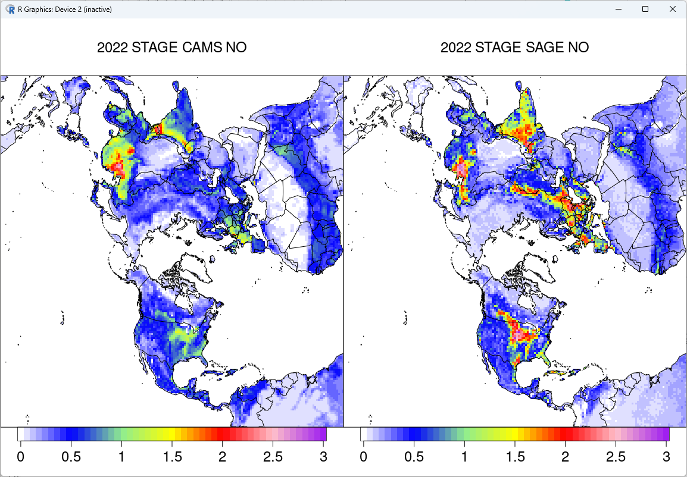 
Figure 1: 2022 Hemispheric CAMS NO (left: 5.2 Tg annually) and SEGA NO (right: 5.4 Tg annually). 

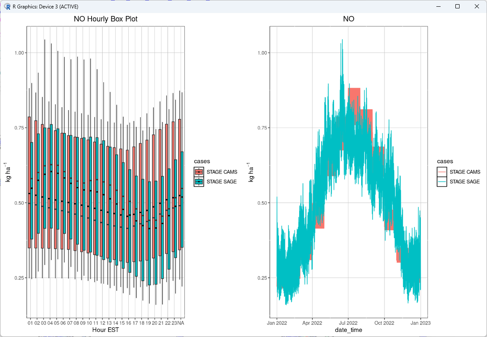
Figure 2: 2022 Hemispheric diurnal emissions profile (right) and emissions time series (right) 

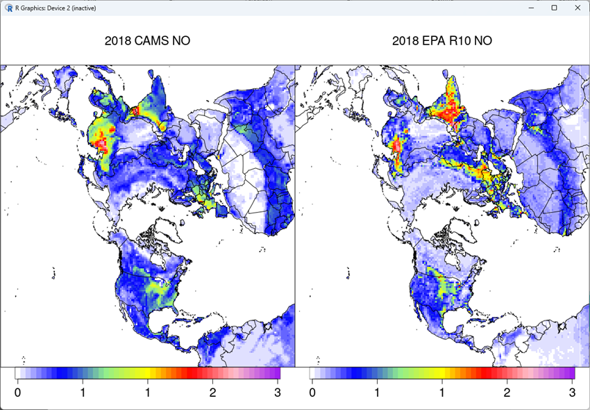
Figure 3: 2018 Hemispheric CAMS NO (left: 5.0 Tg annually) and SEGA NO (right: 4.4 Tg annually). 

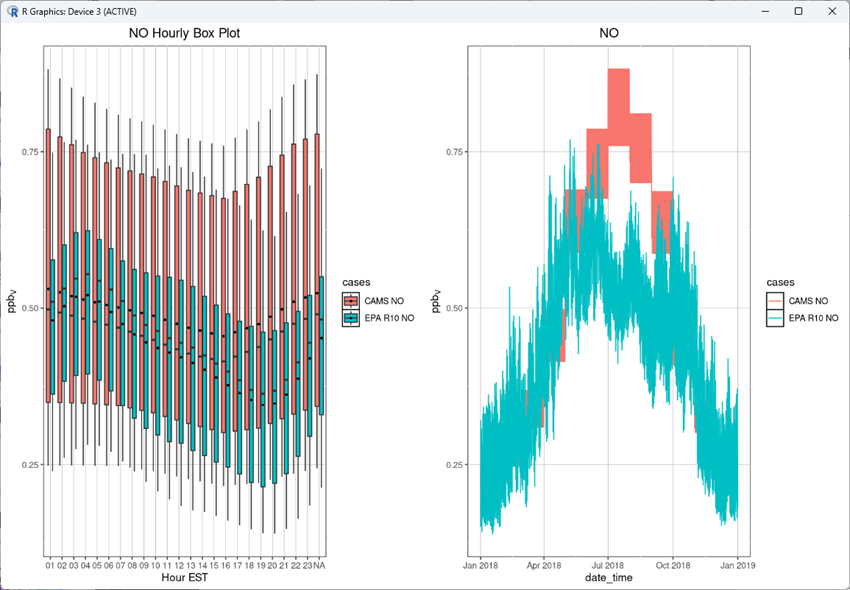
Figure 4: 2018 Hemispheric diurnal emissions profile (right) and emissions time series (right) 

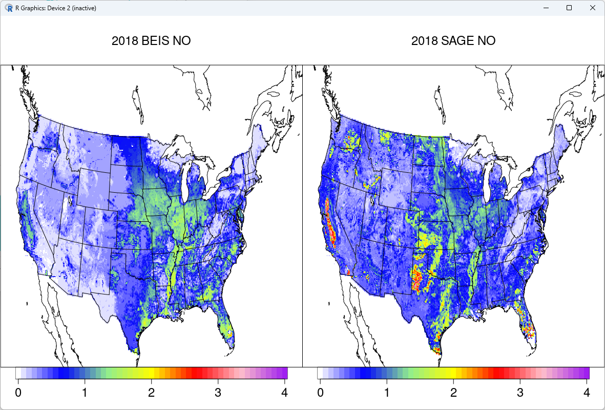
Figure 5: 2018 CONUS BEIS NO (left: 0.4 Tg annually) and SEGA NO (right: 0.5 Tg annually). 

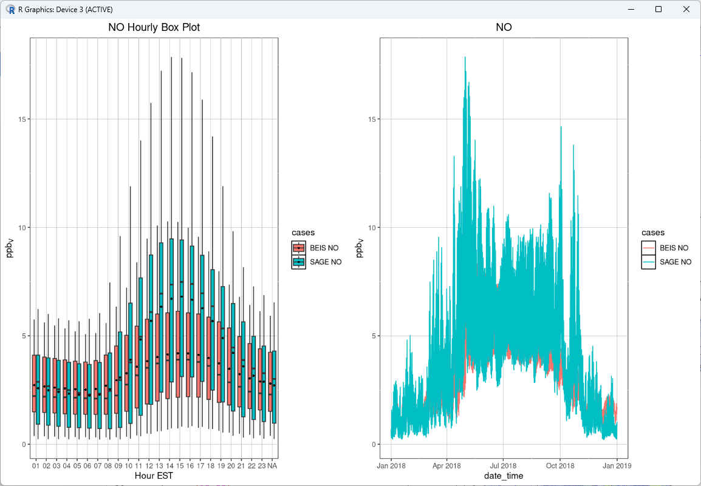
Figure 6: 2018 CONUS diurnal emissions profile (right) and emissions time series (right) 

SEGA NO emissions show a greater degree of variability than the gridded CAMS emissions but are generally close in magnitude for the domain. SEGA emissions peak in late May and Early June and are typically lower from July to August on the hemispheric scale. At the CONUS scale SEGA emissions are 23% higher than BEIS for 2018, exhibit a similar seasonality with higher emissions in fall and higher midday and lower nighttime NO emissions. 

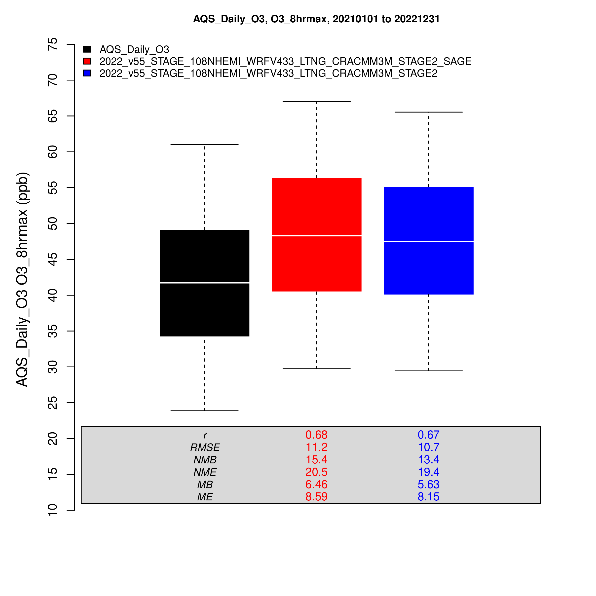
Figure 7, Annual boxplots of max 8-hour ozone at AQS sites for 2022 108 Hemi simulations with CRACMM3 for SEGA (Red), and the Base case (Blue)

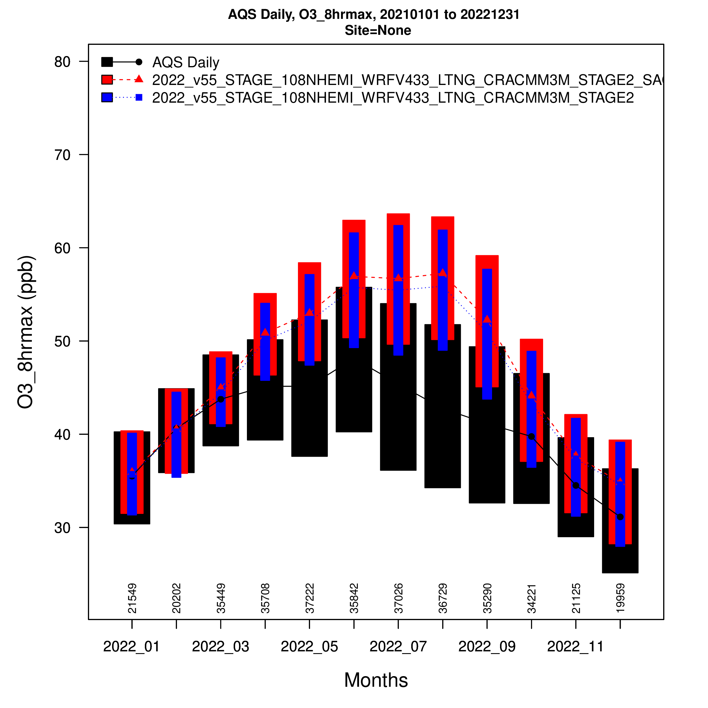
Figure 8, Monthly boxplots of max 8-hour ozone at AQS sites for 2022 108 Hemi simulations with CRACMM3 for SEGA (Red), and the Base case (Blue)

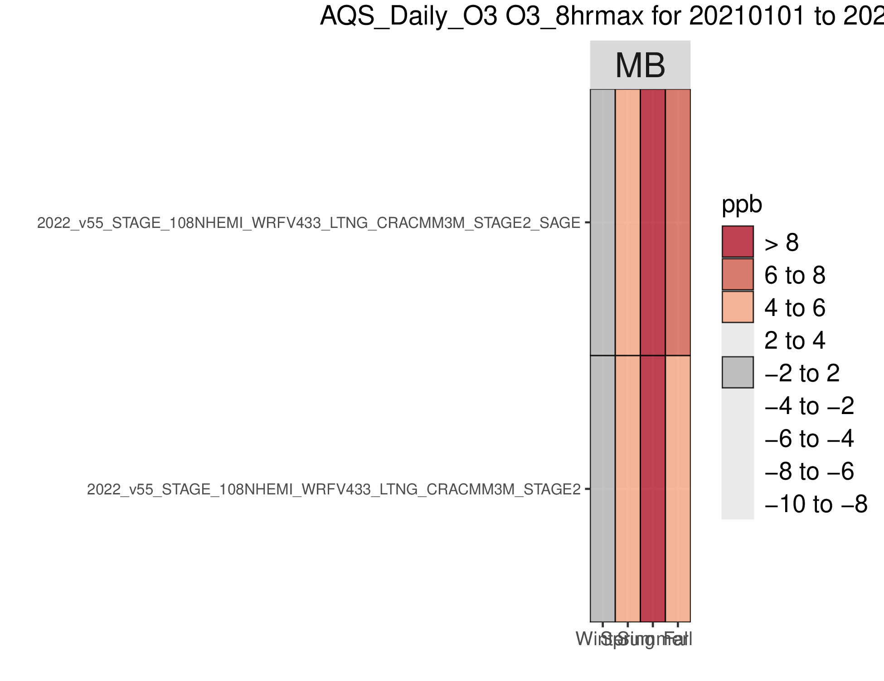
Figure 9, Seasonal Kelly plot of max 8-hour ozone at AQS sites for 2022 108 Hemi simulations with CRACMM3 for SEGA and the Base case (STAGE2)

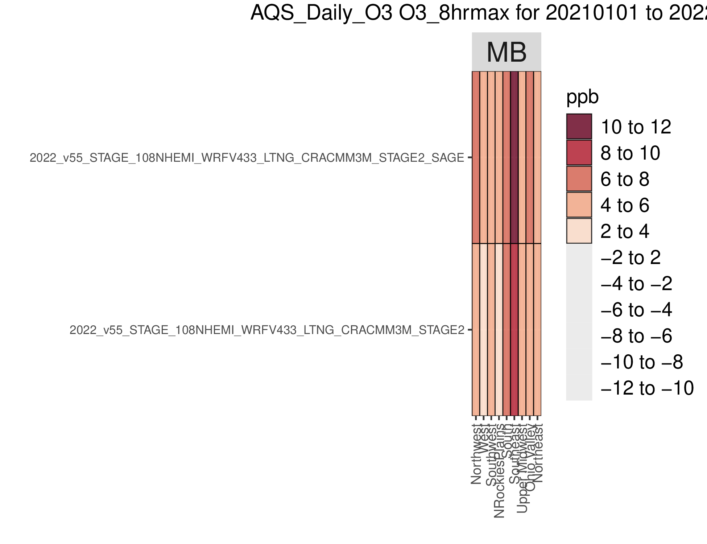
Figure 10, Climate region Kelly plot of max 8-hour ozone at AQS sites for 2022 108 Hemi simulations with CRACMM3 for SEGA and the Base case (STAGE2)

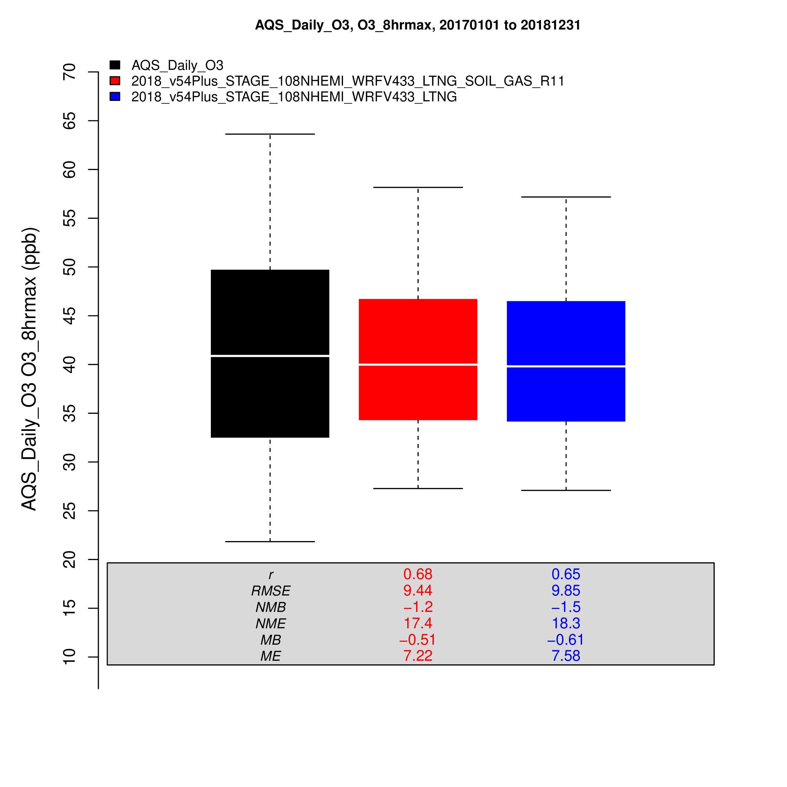
Figure 11, Annual boxplots of max 8-hour ozone at AQS sites for 2018 108 Hemi simulations with CB6r5 for SEGA (SOIL_GAS_R11; Red), and the Base case (Blue)

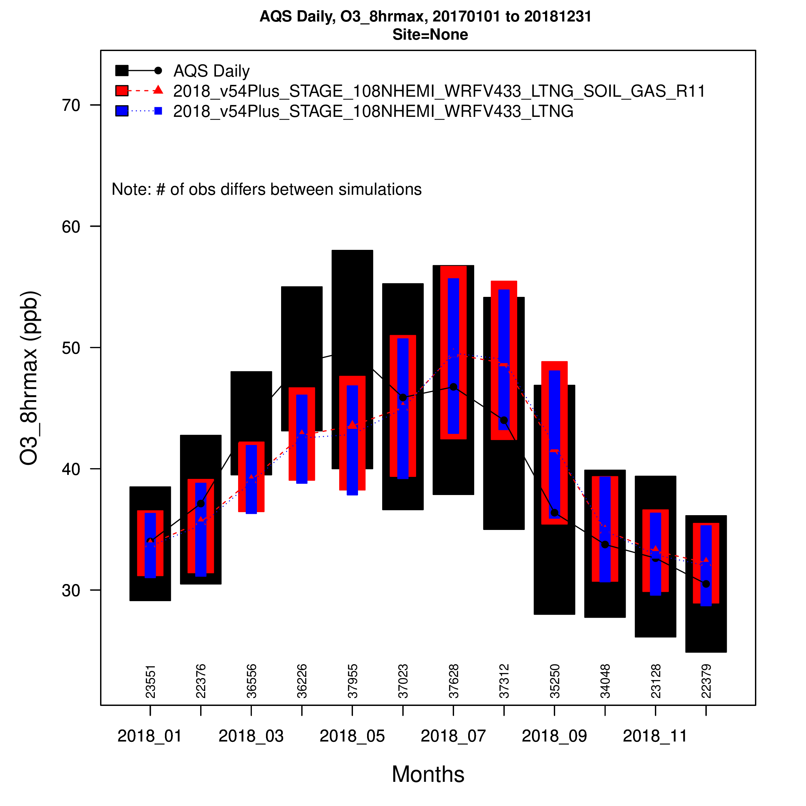
Figure 12, Monthly boxplots of max 8-hour ozone at AQS sites for 2018 108 Hemi simulations with CB6r5 for SEGA (SOIL_GAS_R11; Red), and the Base case (Blue)

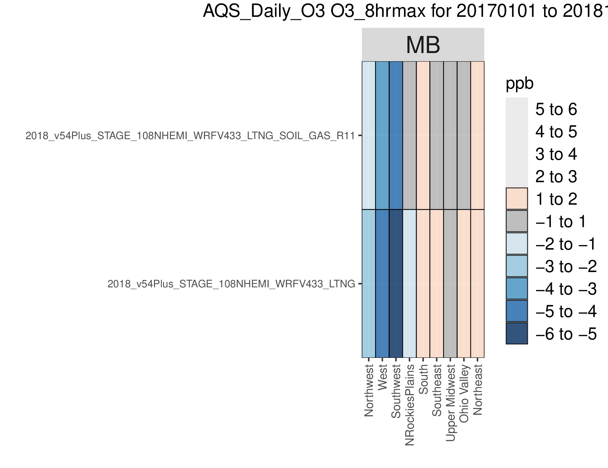
Figure 13, Climate region Kelly plot of max 8-hour ozone at AQS sites for 2018 108 Hemi simulations with CB6r5 for SEGA (SOIL_GAS_R11) and the Base case

|Merge Commit | Internal record|
|:------:|:-------:|
|[Merge for PR#1332](https://github.com/USEPA/CMAQ_Dev/pull/1332/commits/56687957431443800ffdb28ed51e1e53540b0ac1) | [PR#1332](https://github.com/USEPA/CMAQ_Dev/pull/1332)  | 
| | [PR#1379](https://github.com/USEPA/CMAQ_Dev/pull/1379) | 
